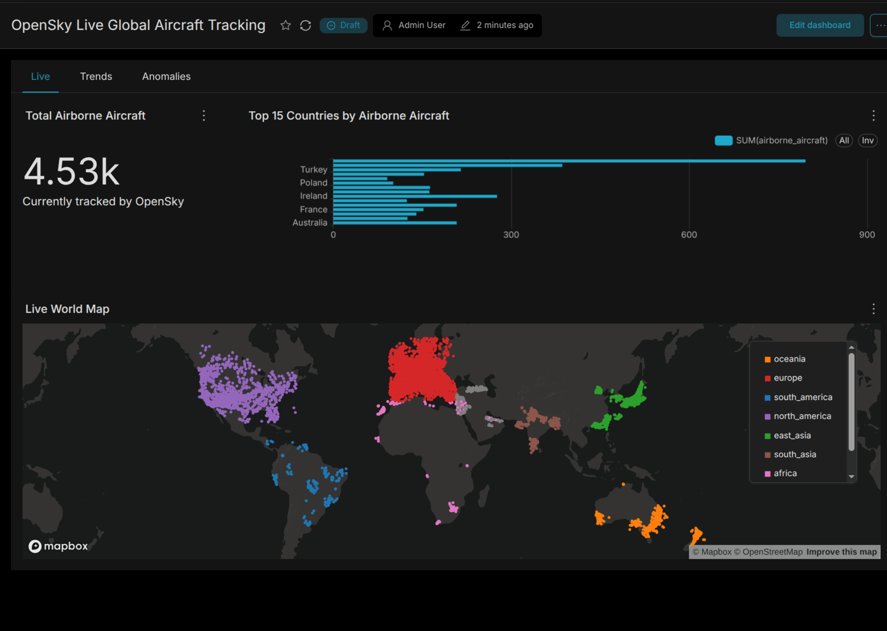
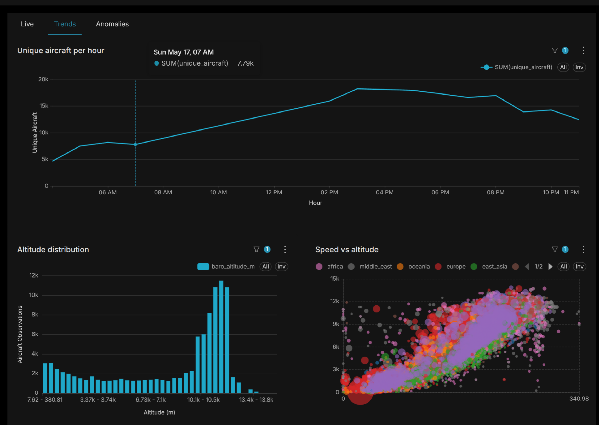
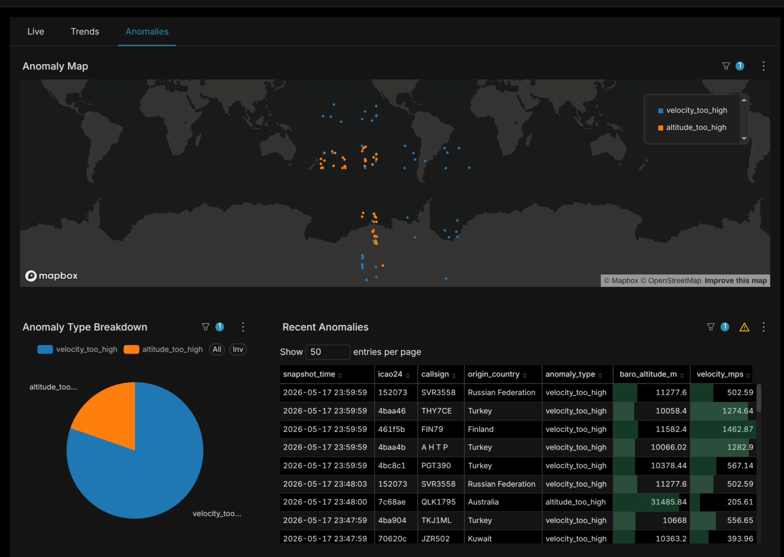
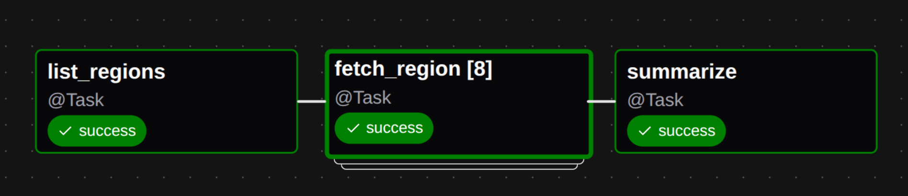
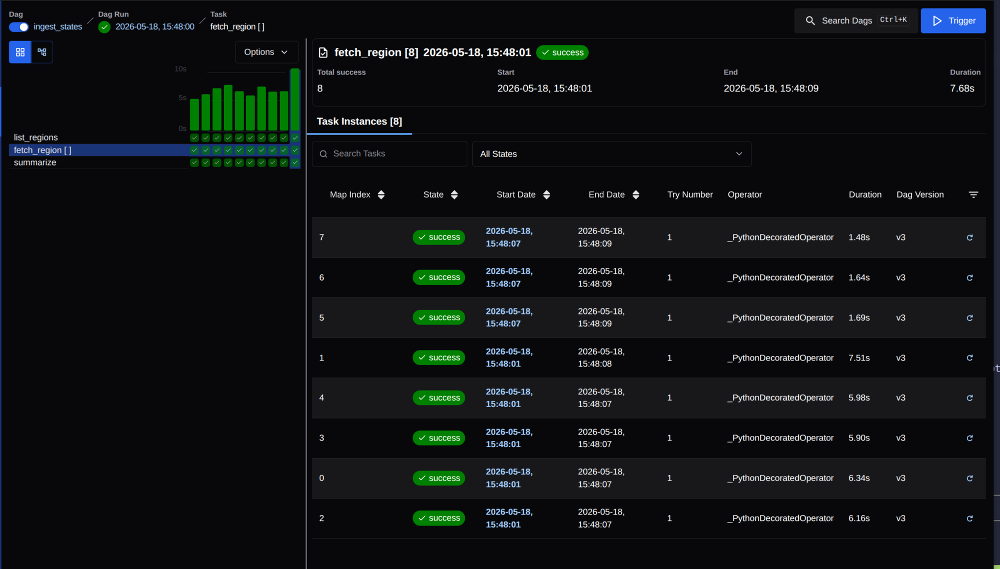
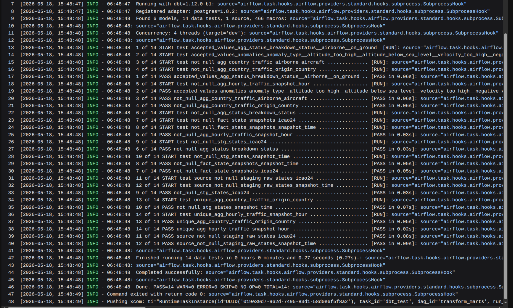

# OpenSky Live: a local-first data platform

A local data pipeline that pulls live aircraft state from the
[OpenSky Network](https://opensky-network.org), shapes it through
bronze/silver/gold layers, and serves analytics in Superset. The whole
stack runs in Docker Compose. No cloud accounts, no managed services.

## Why this exists

I wanted a hands-on Airflow 3 project that wasn't a tutorial demo. Real
ingestion against a real API, real dbt transformations with tests, real
BI on top, and the whole thing reproducible from a fresh clone in a few
minutes.

## What this demonstrates

A few things that don't always show up in tutorial-grade pipelines:

- **Dynamic task mapping** over 8 geographic regions with independent
  retries and logs. A 429 over Europe doesn't lose the snapshot over Asia.
- **Three-DAG asset chain.** `ingest_states` lands raw parquet and emits
  `raw_states_landed`. `tableize_states` triggers off that, appends to an
  Apache Iceberg table, and emits `bronze_states_table` on successful
  commit. `transform_marts` triggers off *that* and rebuilds the dbt
  marts straight from the Iceberg table. No polling, no cron
  coupling between DAGs.
- Per-task retry strategy. Ingestion retries fast with exponential backoff
  (network errors are transient); the transform retries once with a longer
  delay (a failed dbt run usually needs a human).
- A pytest case (`tests/test_credit_budget.py`) that computes daily OpenSky
  credit consumption from the live region config and asserts it stays under
  the 4,000/day quota. Anyone who changes the schedule has to confront the
  budget consciously.
- Bronze raw (parquet in Garage as immutable audit evidence), bronze
  table (Iceberg, the canonical analytical layer), silver (typed dbt
  models over a rolling 30-day Iceberg window), gold (Iceberg mart
  tables, built by dbt-trino), with dbt tests in the DAG path so bad data
  fails the run instead of landing silently.
- **Declarative Superset.** Datasets, charts, and the dashboard live as YAML
  in `superset/assets/` and get re-imported on every container start.
  Anything you build in the UI but don't export gets overwritten.

## Screenshots

### Dashboard

`Live` tab. Total airborne count, top-15 countries by tail-count, and a
deck.gl world map colored by region. The map is pinned to the last 30
minutes of `fact_state_snapshots` via a Custom SQL filter, so it always
reflects "now".



`Trends` tab. The diurnal cycle is obvious in the hourly line: trough
around 04:00 UTC when North America is asleep, peak around 16:00 UTC when
US morning overlaps with European afternoon. The altitude histogram is
bimodal (a small climb/descent hump near zero, a big cruise spike around
11 km). The bubble chart shows the speed-vs-altitude flight envelope
colored by region, with bubble size as ping count per aircraft.



`Anomalies` tab. Map of detected outliers colored by anomaly type, type
breakdown pie, and a table of the most recent 50. Most anomalies cluster
over oceans, which is exactly where ADS-B coverage is thin and aircraft
are in steady high-altitude cruise — the regime where a transponder
glitch produces an out-of-range value.



### Pipeline internals

The `ingest_states` DAG. Three tasks: `list_regions` is the expansion
source, `fetch_region` is mapped over 8 regions, and `summarize` emits
the `raw_states_landed` asset event.



Mapped instances. Eight `fetch_region` task instances run in parallel,
each with its own retries and logs. Wall clock for all eight: 7.7s;
slowest single region: ~6s.



The raw landing zone in Garage. Each snapshot writes 8 parquet files under
`bronze/states_raw/dt=.../hr=.../min=.../region=*.parquet`. These files
are the immutable ingestion evidence — they're never rewritten or
compacted; the Iceberg layer above handles that. Sizes range from ~12 to
~180 KiB depending on how busy the region is — Europe and North America
dominate. Recent partitions, via `rclone lsl garage:opensky`:

```
    16767 2026-05-19 06:48:04.841000000 bronze/states_raw/dt=2026-05-19/hr=06/min=48/region=africa.parquet
    42178 2026-05-19 06:48:04.429000000 bronze/states_raw/dt=2026-05-19/hr=06/min=48/region=east_asia.parquet
   169455 2026-05-19 06:48:05.869000000 bronze/states_raw/dt=2026-05-19/hr=06/min=48/region=europe.parquet
    16911 2026-05-19 06:48:05.658000000 bronze/states_raw/dt=2026-05-19/hr=06/min=48/region=middle_east.parquet
    68404 2026-05-19 06:48:04.024000000 bronze/states_raw/dt=2026-05-19/hr=06/min=48/region=north_america.parquet
    26751 2026-05-19 06:48:03.201000000 bronze/states_raw/dt=2026-05-19/hr=06/min=48/region=oceania.parquet
    13116 2026-05-19 06:48:04.634000000 bronze/states_raw/dt=2026-05-19/hr=06/min=48/region=south_america.parquet
    22204 2026-05-19 06:48:02.999000000 bronze/states_raw/dt=2026-05-19/hr=06/min=48/region=south_asia.parquet
    17390 2026-05-19 07:00:06.249000000 bronze/states_raw/dt=2026-05-19/hr=07/min=00/region=africa.parquet
    41545 2026-05-19 07:00:03.948000000 bronze/states_raw/dt=2026-05-19/hr=07/min=00/region=east_asia.parquet
   174299 2026-05-19 07:00:06.668000000 bronze/states_raw/dt=2026-05-19/hr=07/min=00/region=europe.parquet
    16116 2026-05-19 07:00:06.657000000 bronze/states_raw/dt=2026-05-19/hr=07/min=00/region=middle_east.parquet
    64877 2026-05-19 07:00:04.612000000 bronze/states_raw/dt=2026-05-19/hr=07/min=00/region=north_america.parquet
    26847 2026-05-19 07:00:05.430000000 bronze/states_raw/dt=2026-05-19/hr=07/min=00/region=oceania.parquet
    12893 2026-05-19 07:00:05.636000000 bronze/states_raw/dt=2026-05-19/hr=07/min=00/region=south_america.parquet
    22127 2026-05-19 07:00:03.565000000 bronze/states_raw/dt=2026-05-19/hr=07/min=00/region=south_asia.parquet
    18722 2026-05-19 07:12:05.101000000 bronze/states_raw/dt=2026-05-19/hr=07/min=12/region=africa.parquet
    41444 2026-05-19 07:12:03.717000000 bronze/states_raw/dt=2026-05-19/hr=07/min=12/region=east_asia.parquet
   179090 2026-05-19 07:12:04.599000000 bronze/states_raw/dt=2026-05-19/hr=07/min=12/region=europe.parquet
    18857 2026-05-19 07:12:05.270000000 bronze/states_raw/dt=2026-05-19/hr=07/min=12/region=middle_east.parquet
    59917 2026-05-19 07:12:03.891000000 bronze/states_raw/dt=2026-05-19/hr=07/min=12/region=north_america.parquet
    26475 2026-05-19 07:12:03.538000000 bronze/states_raw/dt=2026-05-19/hr=07/min=12/region=oceania.parquet
    13702 2026-05-19 07:12:04.865000000 bronze/states_raw/dt=2026-05-19/hr=07/min=12/region=south_america.parquet
    21925 2026-05-19 07:12:03.359000000 bronze/states_raw/dt=2026-05-19/hr=07/min=12/region=south_asia.parquet
```

dbt tests in the DAG path. After `dbt_run_trino`, `dbt_test_trino` runs all 12
schema and source tests. If any fail, the DAG fails. The pytest suite
in `tests/` adds DAG-structure and credit-budget checks on top.



## Architecture

```
OpenSky REST API (live, global aircraft state)
                │
                ▼
   ┌──────────────────────────────────┐
   │  ingest_states (Airflow)         │
   │  every 12 min, dynamic mapping   │
   │  over 8 geographic regions       │
   └─────────────┬────────────────────┘
                 │  8 parquet files per run, manifest row per file
                 ▼
       Garage bronze/states_raw/dt=.../hr=.../min=.../region={X}.parquet
       Postgres public.ingestion_manifest (one row per landed file)
                 │
                 │  Asset event: raw_states_landed
                 ▼
   ┌──────────────────────────────────┐
   │  tableize_states (Airflow)       │
   │  drain manifest queue            │
   │  → single PyIceberg append commit│
   └─────────────┬────────────────────┘
                 │
                 ▼
       Iceberg bronze.opensky_states (canonical analytical truth)
         warehouse: s3://opensky/warehouse/bronze.db/opensky_states/
         catalog:   Polaris REST catalog (metastore in postgres-analytics)
         partition: days(snapshot_time)
                 │
                 │  Asset event: bronze_states_table
                 ▼
   ┌──────────────────────────────────┐
   │  transform_marts (Airflow)       │
   │  dbt deps → dbt run → dbt test   │
   │  (dbt-trino, --target trino)     │
   └─────────────┬────────────────────┘
                 │
                 ▼
       Iceberg silver + gold  (Polaris-backed, built via Trino)
         iceberg.silver.stg_states           (table: typed, deduped)
         iceberg.silver.fact_state_snapshots (per-aircraft positions)
         iceberg.gold.agg_country_traffic    (latest snapshot, by country)
         iceberg.gold.agg_hourly_traffic     (time series, by hour)
         iceberg.gold.anomalies              (data-quality outliers)
                 │
                 ▼
       Superset (BI)  — reads Trino
         OpenSky Live Global Aircraft Tracking dashboard
         Three tabs: Live (KPI, top-15 bar, world map),
         Trends (hourly line, altitude histogram, speed-vs-altitude scatter),
         Anomalies (anomaly map, type pie, recent-50 table)
```

## Tech stack

- Apache Airflow 3.2 for orchestration. TaskFlow API, dynamic task mapping,
  asset-driven scheduling across a three-DAG chain.
- Apache Iceberg (via PyIceberg) for the bronze analytical table.
  Polaris-backed REST catalog, day-partitioned by snapshot_time, written
  exclusively by `tableize_states` (single canonical writer).
- dbt-trino for the silver/gold layers. A custom
  `generate_schema_name` macro keeps schemas named `silver` and `gold`
  rather than the doubled-up form dbt produces by default.
- Garage as a local S3-compatible object store for raw landing
  (`bronze/states_raw/`) and the Iceberg warehouse (`warehouse/`).
- polars + pyarrow for in-memory transforms in the ingestion and Iceberg
  load paths.
- Apache Superset for the BI layer. Datasets, charts, and dashboards
  bootstrap from YAML on container start.
- Three separate Postgres instances (Airflow metadata, analytics
  warehouse, Superset metadata). See [Storage layout](#storage-layout)
  for why.
- Docker Compose for the whole stack. Ports in the 33xxx–39xxx range
  bound to loopback only, so the stack doesn't collide with anything
  else running locally.

## Storage layout

Three Postgres instances, by design, plus Garage:

| Service                | Role                                                    | Why separate                                    |
|------------------------|---------------------------------------------------------|--------------------------------------------------|
| `postgres-airflow`     | Airflow metadata: DAG runs, XCom, etc.                  | Latency-sensitive; scheduler heartbeat depends on it |
| `postgres-analytics`   | Analytics support DB: Polaris metastore + manifest      | Bursty heavy queries; mustn't threaten scheduler |
| `postgres-superset`    | Superset metadata: dashboards, charts                   | Different upgrade cadence; recoverable from YAML in repo |
| `garage` (object store) | Raw parquet + Iceberg warehouse                        | Cheap, append-only, partitioned for query pruning |

The rule I'm following is: don't mix orchestration metadata with
analytical data. A runaway query that locks tables shouldn't be able to
take down the scheduler. Each Postgres has its own user, volume, and
backup profile, and the analytics user has no read access to Airflow's
connection passwords.

## Quickstart

```bash
git clone <this-repo>
cd opensky-airflow
cp .env.example .env
# Fill in the blank secrets in .env. Each has a "Generate with:" hint
# in the example file. MAPBOX_API_KEY is optional; without it, the
# deck.gl maps render points on a black background.
docker compose up -d

# Once the stack is healthy, run the test suite:
docker compose exec airflow-scheduler bash -c "cd /opt/airflow && pytest tests/ -v"
```

First boot takes ~3–5 minutes for image builds and the initial Postgres
migrations.

When healthy:

| Service             | URL                              | Login                |
|---------------------|----------------------------------|----------------------|
| Airflow             | http://localhost:38080           | admin / admin        |
| Superset            | http://localhost:38088           | from `.env`          |
| Analytics Postgres  | localhost:35432                  | from `.env`          |

> Open Superset via `http://localhost:38088`, not `http://127.0.0.1:38088`.
> Mapbox URL restrictions don't accept IP literals, so the basemap fails
> silently on the IP form. The port binding accepts both either way.

> Garage doesn't ship a first-party web UI. For browser-based admin,
> point [garage-webui](https://github.com/khairul169/garage-webui) at
> the admin API on port 3903. Not bundled here.

To populate data: in Airflow, unpause `ingest_states` and trigger it. The
asset-driven `transform_marts` cascades automatically. Within a minute
the Superset dashboard fills with live data.

## Key design decisions

**Thin DAGs, fat helpers.**
DAG files import from `include/` and call helpers inside `@task`
functions. This keeps DAG-parse time low (the scheduler re-parses every
file on a short interval) and isolates infrastructure failures from DAG
registration.

**Dynamic task mapping over geographic regions.**
The world is split into 8 bounding boxes in `include/regions.py`. Each
region fetches in parallel as its own task instance with independent
retries and logs. A 429 over Europe doesn't lose the snapshot over Asia.
The bboxes are continent-sized rather than fine-grained because
OpenSky's credit pricing is tiered: once a bbox exceeds 400 sq deg, it
costs 4 credits per call regardless. Splitting a large area into smaller
boxes costs *more* credits in total, not fewer.

**Schedule pinned to fit the credit budget.**
Each `/states/all` call with a >400 sq deg bbox costs 4 credits. Eight
regions per run is 32 credits. The registered-user quota is 4,000
credits/day, so the schedule is `*/12 * * * *` (120 runs/day = 3,840
credits/day, with headroom for retries). A pytest case in `tests/`
enforces this: change the schedule or the regions and the test fails
until the math is updated.

**Asset-triggered chain, not `ExternalTaskSensor`.**
Three DAGs are wired via asset events declared in `include/assets.py`:
`ingest_states` emits `raw_states_landed` after writing parquet;
`tableize_states` triggers on that, commits to Iceberg, and emits
`bronze_states_table`; `transform_marts` triggers on that and rebuilds
marts. No polling, no cron coupling between DAGs, and each step is
independently rollback-able.

**Iceberg as the analytical boundary, raw parquet as evidence.**
`bronze/states_raw/*.parquet` files are immutable ingestion evidence —
small, partitioned, never rewritten. The Iceberg `bronze.opensky_states`
table is the canonical analytical surface — typed columns, day-partitioned,
written by a single writer (`tableize_states`), read by everything
downstream. The split makes audit trivial (every raw file is in
`public.ingestion_manifest` with its Iceberg commit timestamp) and lets
us evolve the analytical schema without touching the raw files.

**Trino-only mart builds, straight off Iceberg.**
`transform_marts` triggers on the `bronze_states_table` asset and runs
`dbt run`/`dbt test` against the Trino `iceberg` catalog. `stg_states`
reads `bronze.opensky_states` directly with a rolling 30-day filter and
deduplicates by `(icao24, snapshot_time)`; the silver/gold marts are
rebuilt (REPLACE) each run. No Postgres staging table and no watermark
cursor — Iceberg snapshots are the incremental boundary.

**Three Postgres instances, not one.**
Detailed in [Storage layout](#storage-layout). Scheduler metadata,
Polaris/manifest metadata, and BI metadata have different latency profiles, backup
needs, and failure semantics. Mixing them creates a single point of
failure that isn't worth the saved overhead.

**Custom dbt `generate_schema_name`.**
By default dbt concatenates the profile schema with the per-folder
schema config, producing names like `gold_silver` and `gold_gold`.
The override in `dbt/opensky/macros/generate_schema_name.sql` uses the
per-folder name as-is. Cleaner names; the standard fix for
single-environment setups.

**Declarative Superset bootstrap.**
Database connections, datasets, charts, and the dashboard all live as
YAML in `superset/assets/`. On container start, a bootstrap script
calls `ImportAssetsCommand` inside a Flask app context. This is more
reliable than the CLI across Superset versions. Credentials get
substituted from env vars at import time and are never committed to
YAML.

**Env-driven secrets, fail-on-missing.**
Every secret in Compose uses `${VAR:?error msg}`. Compose refuses to
start if a required secret is unset. This prevents the
"accidentally inherited the dev default in staging" class of bug.

## Project layout

```
opensky-airflow/
├── Dockerfile                       # Airflow image with project deps
├── docker-compose.yml               # Full stack
├── docker-compose.override.yml      # Host port bindings (loopback only)
├── docker-compose.local.yml         # Host-specific overrides (gitignored; via COMPOSE_FILE)
├── .env.example                     # Secrets template
├── dags/                            # Airflow DAG definitions (thin)
│   ├── ingest_states.py
│   ├── tableize_states.py           # Iceberg loader (asset-triggered)
│   ├── transform_marts.py
│   ├── maintain_iceberg_states.py
│   ├── maintain_iceberg_marts.py
│   └── backup_polaris.py            # Polaris metastore backup to Garage
├── include/                         # Logic imported by DAGs
│   ├── opensky_client.py            # API client with auth + retries
│   ├── s3_helpers.py                # Parquet IO via s3fs
│   ├── regions.py                   # Geographic bbox config
│   ├── assets.py                    # Centralized Asset URIs
│   ├── iceberg.py                   # PyIceberg table contract + Polaris catalog
│   └── manifest.py                  # Ingestion manifest + Iceberg load queue
├── scripts/                         # One-shot operational helpers
│   └── backfill_legacy_bronze_states.py
├── dbt/opensky/                     # dbt project
│   ├── dbt_project.yml
│   ├── profiles.yml
│   ├── macros/
│   │   └── generate_schema_name.sql
│   └── models/
│       ├── sources.yml
│       ├── staging/stg_states.sql
│       ├── silver/fact_state_snapshots.sql
│       └── marts/
│           ├── agg_country_traffic.sql
│           ├── agg_hourly_traffic.sql
│           └── anomalies.sql
├── superset/                        # Superset image, bootstrap, asset bundle
│   ├── Dockerfile
│   ├── bootstrap.sh
│   ├── superset_config.py
│   └── assets/                      # Round-trippable YAML
│       ├── metadata.yaml
│       ├── databases/trino-iceberg.yaml
│       ├── datasets/analytics/
│       ├── charts/
│       └── dashboards/
└── tests/                           # pytest: DAG integrity, credit budget
    ├── conftest.py
    ├── test_dag_integrity.py
    └── test_credit_budget.py
```

## Tests

```bash
docker compose exec airflow-scheduler bash -c "cd /opt/airflow && pytest tests/ -v"
```

Three things they cover:

- `test_dag_integrity.py` checks that every DAG file parses cleanly, has
  the expected schedule and options, and exposes the expected task set.
  Catches typo-level breakage and accidental schedule changes.
- `test_credit_budget.py` computes the daily OpenSky credit cost from
  the actual `include/regions.py` bboxes and the ingest schedule, and
  asserts it's under 4,000. Forces the budget reasoning to stay
  explicit if anyone changes either.
- A bbox sanity check that every region has valid latitude/longitude
  ranges with `min < max`. Cheap, and it documents the invariant.

## What I would do at scale

Things I'd change if this had to handle real production traffic
instead of one developer's curiosity:

- **Kubernetes executor in Airflow.** LocalExecutor is fine here.
  Per-task isolation via Kubernetes pods would be the production move.
- **Incremental dbt models.** The marts currently rebuild fully on
  every run from a 30-day Iceberg window. At scale, switch to
  `materialized='incremental'` with partition pruning instead of a
  full REPLACE each run.
- **Iceberg compaction.** Tracked in [#9](../../issues/9). Deferred until we actually have small-file pain.
- **Cosmos for dbt.** Right now `dbt run` is one BashOperator. Cosmos
  would split it into one Airflow task per dbt model, for per-model
  retries and observability in the Airflow UI.
- **A real secrets backend.** Local `.env` works in dev; in production,
  AWS Secrets Manager or GCP Secret Manager via Airflow's secrets
  backend. The env-var contract stays the same; only the source changes.
- **Source freshness checks.** dbt source freshness plus Airflow
  Deadline Alerts for SLO monitoring.
- **A second ingestion DAG.** `ingest_flights` for OpenSky's
  `/flights/arrival` and `/flights/departure` endpoints on a daily
  schedule, joined into mart tables by route.
- **Observability stack.** StatsD → Prometheus → Grafana wired to
  Airflow's built-in metrics, with a custom statsd mapping file to
  prevent cardinality explosions from per-DAG metric names becoming
  labels.

## License

MIT
