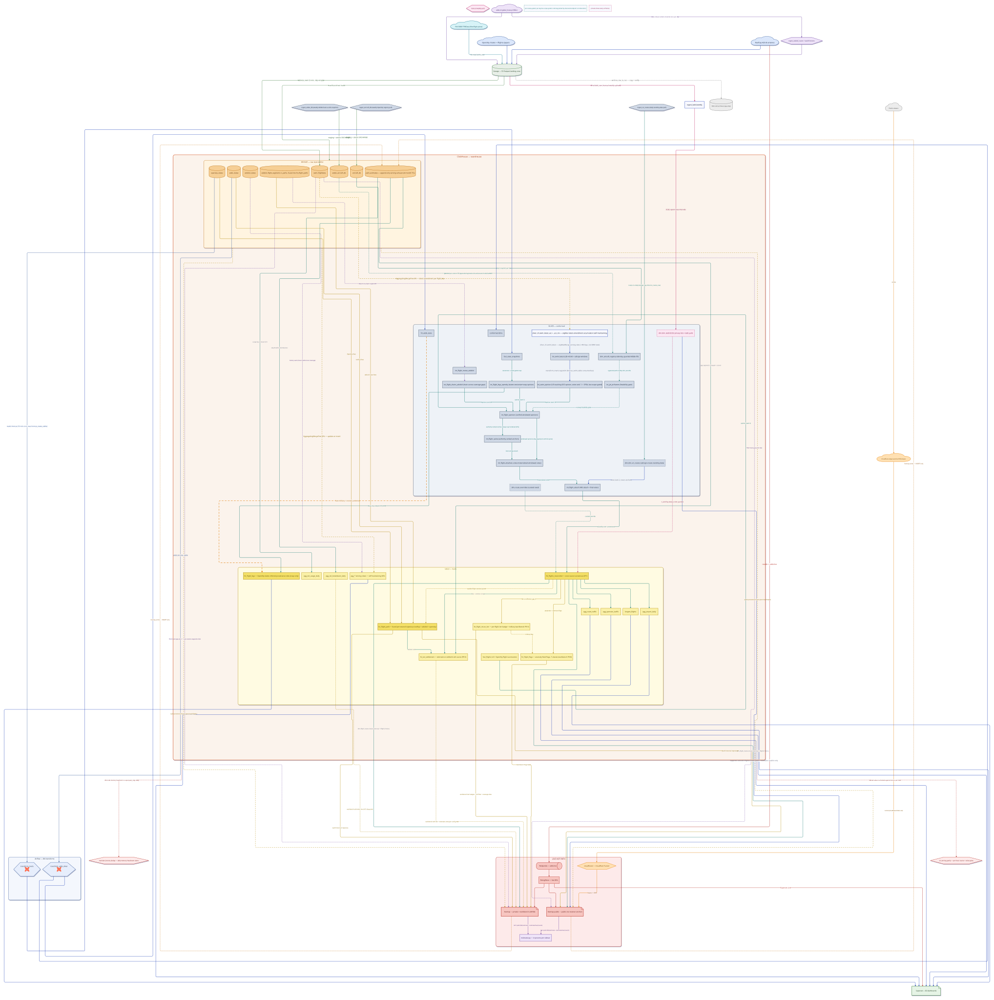

# sancha1090: a local-first data platform

A rooftop ADS-B receiver over Tokyo feeds two paths at once: a streaming hot path
(Redpanda → RisingWave) for what is overhead right now, and Airflow-orchestrated
bronze/silver/gold marts (Garage S3 → ClickHouse → dbt → Superset) for the accumulated
history. Both run on a single host under Docker Compose, with no cloud accounts. The
live hot-path map is public at **[sancha1090.tokyo](https://sancha1090.tokyo)**.

The receiver is the anchor, and whatever it hears directly is ground truth. The
[OpenSky Network](https://opensky-network.org) covers what one antenna cannot: all of
Japan and the surrounding ocean beyond the receiver's horizon, plus arrival and departure
records for where those flights came from and are headed. [adsb.lol](https://adsb.lol)'s
ODbL `globe_history` supplies the deep past, filling in the hours before the pipeline
existed. Each source keeps its own bronze table and its own refresh track, and they fuse
only at well-defined seams, the sharpest being `gold.fct_flight_legs`.

> Data model: the full column-level schema, lineage, and entity map for every
> bronze/silver/gold table live in [`docs/datalake.md`](docs/datalake.md).
> 
## Architecture

The rooftop, OpenSky, and adsb.lol feeds land as Parquet in the Garage S3 zone and load
into ClickHouse bronze via manifest-driven per-file bookkeeping. They stay on separate
refresh tracks, partitioned by dbt tag so they never race, and fuse only in
`gold.fct_flight_legs`. (The FAA SWIM lane below lands in the same zone on its own track.)
Cheap aggregates skip the rebuild cycle entirely: `AggregatingMergeTree` views update on
insert and serve through merge-aware views. Every served value is re-checked hourly against
bronze by the `ch_serving_parity` gate.

`bronze.path_estimates` sits outside that mart flow as append-only serving exhaust. Each
recorded computation keeps one request row plus one row per emitted segment for 24 months,
including a request row for logged non-results. Flight-keyed requests carry the flight id
AND the aircraft hex (rev 10.4: the flight id is a build-generation hash that does not
survive settlement — the hex is the durable settlement key); live requests log hex-keyed
rows (`flight_id` NULL, `subject_key h:<icao24>`, the anchor-fix timestamp). The livemap
writes it through the INSERT-only `livemap_writer` identity; estimate geometry never
enters the silver/gold flight marts — the gold footprint is serving TELEMETRY only
(usage counts, distributions, and scalar settlement scores; rev 10.3/10.4), never
estimated positions. Rows are sidecar-attributed — the public
instance stamps `producer='serving-public'`, the private one `'serving-private'` (rows from
before the split keep the legacy `'serving'`) — and two small analytics marts aggregate the
exhaust daily: `gold_ch.agg_est_usage_daily` (requests/served/segments/subjects by producer
and arm, UTC days) and `gold_ch.agg_est_breakdown_daily` (skip-reason, segment-kind, and
uncertainty-bin distributions). The standing demand read is
`SELECT day, requests, served FROM gold_ch.agg_est_usage_daily WHERE producer = 'serving-public' ORDER BY day`.

`gold_ch.fct_est_settlement` closes the loop on estimate quality: it re-keys every served
gap segment to the settled trajectory mart (hex + time overlap going forward; entry∩exit
anchor intersection for legacy rows) and scores the estimate polyline against real
coverage that arrived after serving — per-point errors as scalar arrays, zero coordinate
columns, full-recompute semantics (scores legitimately move as truth arrives and paths
repair — never alert on day-over-day deltas). Ambiguous re-keys are excluded from scores
but counted (`skip_ambiguous`); anchor-re-keyed and provisional-arm rows carry a
documented causality qualification. The standing drift read pools per-point errors
deduped to unique inputs — never median-of-medians, which measurably hides drift —
grouped by `config_hash` (the sole instrument discriminator):

```sql
SELECT uncertainty_bin, config_hash, count() AS settled_segments,
       uniqExact(input_fingerprint) AS subjects,
       arraySort(groupArrayArray(errs_km)) AS pool,
       if(length(pool) = 0, NULL, pool[toUInt32(ceil(0.5 * length(pool)))]) AS pooled_p50_km,
       if(length(pool) = 0, NULL, pool[toUInt32(ceil(0.9 * length(pool)))]) AS pooled_p90_km,
       any(served_p50_km) AS band_p50, any(served_p90_km) AS band_p90
FROM (SELECT * FROM gold_ch.fct_est_settlement
      WHERE skip_ambiguous = 0 AND settled = 1
      ORDER BY computed_at, estimate_id LIMIT 1 BY input_fingerprint, seg_idx)
GROUP BY uncertainty_bin, config_hash ORDER BY uncertainty_bin, config_hash
```

The `gap_180m_plus` uncertainty band deliberately keeps its `≥` floor: warehouse-resident
truth cannot calibrate it (the fully-covered long-duration population is loiter orbits,
physically disjoint from the transpacific cruise gaps the band serves), so the floor
stands until served-regime truth accumulates in the settlement mart itself.

<p align="center">
  <picture>
    <source media="(prefers-color-scheme: dark)" srcset="docs/architecture-dark.svg">
    
  </picture>
</p>

Provenance lives in Postgres (`public.ingestion_manifest` for the OpenSky, adsb.lol, and
FAA SWIM lanes, `public.adsb_ingestion_manifest` for the rooftop antenna), one row per
landed file. The ingest path fails loud on anything it does not recognize: a producer
manifest outside its lane's prefix, or an unregistered object under the ADS-B prefix,
aborts the run rather than blending sources. See [`docs/datalake.md`](docs/datalake.md)
for the full lineage, entity map, and per-table schema.

### FAA SWIM: filed flight plans

A fourth, independent lane taps FAA SWIM (System Wide Information Management), specifically
the SWIM Cloud Distribution Service's TFMData feed of filed flight plans. An always-on
`swim-consumer` service holds a persistent subscription, parses each message, and flushes
rolling Parquet to the same Garage zone (`bronze/swim_raw/`). The write has to land durably
before the message is acknowledged, so a dropped connection cannot silently lose data. A
5-minute `tableize_swim` DAG (skipping ticks with nothing new to load) drains it into
`bronze.swim_flightdata`, and `transform_marts` builds two models on top: `int_swim_flight`,
the latest amendment per flight plus a density-scored callsign→icao24 match against the
states feeds, since SWIM carries no Mode-S hex of its own; and `int_swim_opinion`, an
origin/destination read scoped to US-touching flights, including the foreign endpoint on
international legs that the antenna and OpenSky's Japan box never see (the San Francisco
side of a Tokyo to San Francisco flight, for instance).

`int_swim_opinion` now casts a vote in `gold.fct_flights_reconciled`'s cross-source
consensus, at the top of the source-authority order, though plurality still outvotes
authority: rank only breaks a tie. That vote is scoped further. It fires only for filed
plans with at least one endpoint inside the observation box (20-50°N, 122-165°E), so a pure
overflight, with both endpoints outside the box, stays unresolved instead of picking up a
filed-plan stamp that no in-box source can corroborate.

A second, independent obligation rides the same feed's identity data: the FAA's LADD
privacy list, tracked SCD2 in `dim.dim_ladd` from a weekly pull and applied at display time
on the public livemap only. Live surfaces (`/aircraft`, `/track`, `/estimate/live/{icao24}`)
drop any airframe carrying a currently-open listing. Historical surfaces (`/flights`,
`/path`, `/path/{flight_id}/estimate`) additionally gate on the reconciled mart's `is_ladd`
flag, which covers an airframe's whole history for as long as its listing stays open and
narrows to just the flights overlapping the listed window once that listing closes — they
apply the current open set on top of it, so a newly listed airframe is dropped there without
waiting for a rebuild. Either way the mart flags rather than deletes, so the row stays in the
warehouse; the private LAN instance suppresses nothing, since LADD is a public-display
obligation rather than a data-access restriction. A listing change reaches the live surfaces
on the next weekly pull plus a ~15-minute refresh, and the mart's `is_ladd` only on the next
`transform_marts` build — neither is instant. This is the pipeline's own read of a public FAA
system-wide information feed and a public FAA privacy list. The FAA neither publishes nor
endorses it.

## Architecture evolution

### The Iceberg lakehouse (v2 to v5.12)

sancha1090 began as a local-first medallion lakehouse: the rooftop antenna plus the OpenSky
network feeding bronze → silver → gold Iceberg tables on Garage (S3), a Polaris REST
catalog, and Trino, transformed by dbt-on-Trino and served to Superset. It was deliberately
the full open-table-format stack, with schema evolution, time travel, zero-copy `add_files`
ingest, and a catalog service, and it ran the whole thing on one box. Eighteen released
versions evolved it from a world sweep to a focused Japan feed with a live map, flight legs,
and airline analytics.

### Why it changed: right-sizing to the workload (v6.0)

ADS-B is append-heavy, time-ordered telemetry, which is the canonical columnar-OLAP
workload. As the data grew toward hundreds of millions of rows, the
distributed-query-engine and catalog stack was paying its full operational cost (JVM heap
tuning, worker OOM from view re-expansion, OPTIMIZE-vs-rebuild races, a separate metastore)
for none of its multi-engine or petabyte benefit on a single host. v6.0 replaces the Iceberg
+ Polaris + Trino batch warehouse with ClickHouse, keeping Postgres for manifests and
metadata and RisingWave for the live hot path. That leaves one engine instead of three
services, aggregates that maintain themselves, and an entire class of operational gotchas
deleted. The migration landed as eight reviewed, parity-gated phases. The lakehouse history
lives at the `v5.12` tag.

### What it became: a guarded warehouse (v6.1+)

The post-migration releases turned the parity gates from migration scaffolding into
permanent guarantees. Bronze became dedup-immune (`ReplacingMergeTree` with content
fingerprints, so a crash-replay cannot double-count). An hourly served-value gate re-derives
what Superset shows straight from bronze and refuses to let discrepancies age out unseen.
Storage was re-grained: the verbatim raw-JSON column was eliminated in favor of flags baked
at load, per-column ZSTD/T64 codecs went in, and the exact per-hour aggregate states got a
90-day TTL. A NAS cold archive keeps a verified copy-only mirror of the raw landing zone.
Every lane got source-keyed names plus fail-loud ingest boundary guards, so no source can
silently blend into another.

## Benchmarks: why ClickHouse

ClickHouse was re-measured on the production box at v6.0 (warm, server-side, against the
live ~21.6 M-row `bronze.adsb_states`). The Trino + Iceberg column is the pre-migration
2026-06-19 spike baseline (~19.2 M rows); the lakehouse was retired at v6.0, so those are
the last measured figures, not re-runnable ones. Answers are identical across engines (the
window count is 28 aircraft, `max(r_dst)` is 166.453 nm), so the queries are equivalent.
Speedups are approximate, since the row counts differ.

| Query | Trino + Iceberg (spike) | ClickHouse (re-measured) | Speedup |
|-------|------------------------:|-------------------------:|--------:|
| Point-in-time aircraft count (2-min window) | ~5.1 s | 3 ms | ~1700× |
| Max receiver range (`max(r_dst)`) | ~5.0 s | 8 ms | ~600× |
| Airline traffic rollup (full scan + regex + `uniqExact`) | ~5.0 s | 155 ms | ~30× |
| Day-of-week / time-of-day scan | ~4.8 s | 14 ms | ~340× |

The window query prunes via the `capture_ts` sort key, reading only the 2-minute window out
of 21.6 M rows, where Trino full-scanned the unpartitioned Iceberg table at a flat ~5 s. At
a 10× synthetic 192 M rows the windowed query stayed flat (27 ms, spike projection) while a
full scan grows linearly.

The trade-offs:

- Ingest is no longer zero-copy. Iceberg `add_files` registered edge Parquet for free;
  ClickHouse physically materializes it. A full 19.2 M-row load takes 12 s, with about 2 min
  projected at 200 M.
- Naive storage was bigger, not smaller (3.96 GiB against 1.5 GB of Parquet at v6.0, 39% of
  it a verbatim raw-JSON column). This one got engineered away rather than accepted: v6.3
  eliminated the raw-JSON column, baking its one useful field into a real column at load, and
  added per-column ZSTD/T64 codecs; v6.4 put a verified cold copy of the raw landing zone on
  the NAS.
- Eventual-merge reads. Self-maintaining aggregates need `…Merge()` or `FINAL`, a real
  footgun the mart layer has to respect.
- Mart maintenance got cheaper. Cheap aggregates became incremental views that update on
  insert, which retired the scheduled rebuild along with the OOM and OPTIMIZE-race failure
  modes.

The hardest mart to port was flight-leg sessionization, an ordered cross-row window that
cannot be incremental. It came over with exact parity (143,605 legs, identical boundaries) at
116 ms, spill-safe under a tight memory cap.

## Quickstart

```bash
git clone <this-repo>
cd sancha1090
cp .env.example .env
# Fill the blank secrets in .env (each has a "Generate with:" hint).
docker compose up -d

# Once healthy:
docker compose exec airflow-scheduler bash -c "cd /opt/airflow && pytest tests/ -v"
```

Common tasks are wrapped in a `Makefile`, and `make` lists them (`make up`, `make test`,
`make lint`, `make parse`, `make check`).

First boot takes 3 to 5 minutes for image builds plus the initial Postgres migrations.
Airflow UI at <http://localhost:38080> (admin / admin).

`docker compose up` bootstraps the ClickHouse marts automatically. `clickhouse-init`
provisions the bronze/dim schemas and the hex-country dictionary, then the one-shot
`clickhouse-marts-init` seeds the dims, reloads the dict, and loads the aircraft registry,
so the first transform run has its seed, registry, and dict dependencies in place. The
optional multi-year adsb.lol history backfill is a separate manual step:
`scripts/ch_setup_marts.sh` runs the full setup including the adsb.lol history load.
To rebuild ClickHouse bronze from the Garage landing zone (truncate + reload, with the
tableize DAGs paused and in-flight runs drained so live ticks can't double-insert), run
`scripts/ch_backfill_bronze.sh`.

Trigger `ingest_states` in Airflow to start populating. `tableize_states` and
`transform_marts` cascade automatically via asset events.

### Live hot path (v4)

A single-node Redpanda broker (the `redpanda` service) carries the live ADS-B feed. The
rooftop antenna edge unit publishes readsb state to topic `adsb.live` over the LAN,
advertised at `REDPANDA_EXTERNAL_HOST:19092` (set to the main PC's LAN IP in `.env`). The
`redpanda-init` one-shot creates the topic and enforces its ~10-min retention. The external
listener's host port is not published by default. To expose it on the LAN for the edge, add
it to the gitignored `docker-compose.local.yml` (the same pattern as Garage's `:3900`) and
make sure that file is in `COMPOSE_FILE` (see `.env.example`):

```yaml
# docker-compose.local.yml
services:
  redpanda:
    ports:
      - "0.0.0.0:19092:19092"
```

Verify:

```bash
docker compose exec redpanda rpk cluster info   # broker healthy, lists brokers
docker compose exec redpanda rpk topic list     # shows adsb.live
# from the edge host, prove the advertised listener is reachable
# (<main-pc-ip> = REDPANDA_EXTERNAL_HOST from the main PC's .env):
nc -vz <main-pc-ip> 19092
```

RisingWave (the `risingwave` service, v4.1) consumes `adsb.live` from the internal listener
(`redpanda:9092`) and maintains the enriched live materialized views that Superset's "Live"
dashboard reads over PG-wire. It runs single-node: meta and state live on one local volume,
with no extra sidecars.

The live views use a 120 s staleness window. `mv_current_aircraft` means "aircraft with a
position update in the last 120 s", which matches tar1090's measured position retention.
Fringe aircraft (>60 nmi, weak signal) decode positions tens of seconds apart, and tar1090
keeps showing their last fix for about two minutes, so a tighter window undercounts contacts
it still renders. Expect the count to sit 0 to 1 below tar1090's total, because tar1090 also
lists aircraft heard without a position fix, and those never enter the position feed the hot
path consumes.

Verify:

```bash
docker compose exec postgres-airflow psql -h risingwave -p 4566 -U root -d dev -c 'SELECT version();'
# or from the host (loopback port from docker-compose.override.yml):
psql -h 127.0.0.1 -p 34566 -U root -d dev -c 'SELECT version();'
```

The `livemap` service is a small FastAPI sidecar that polls `mv_current_aircraft` twice a
second into an in-memory snapshot and serves a dark maplibre + deck.gl map of live aircraft
over Tokyo at <http://localhost:38100>. The server-side cache is the point: every browser tab
shares that one query stream, so N viewers never become N queries against RisingWave.
Aircraft dead-reckon between polls (track and groundspeed, capped at 15 s of projection) and
fade with position age over the 120 s window. It has grown into the platform's showcase
surface, with per-type aircraft silhouettes (ICAO Doc 8643), motion trails, a spotlight card
carrying airline, registration, and owner identity, click-to-select 30-minute track history,
a recent-flights drill-down per airframe that draws each flight's own fused historical path
on click, and the antenna's measured coverage outline. Those accumulated-history features are
computed in the ClickHouse batch lane and shipped to the map, so the hot path stays a thin
120-second window. The spotlight exposes an explicit `[show estimated path]` button on any
drawn path, settled or provisional, plus an `[estimate ahead]` control that appears only while
the selected aircraft is still in the live snapshot.

The private instance additionally hosts an **analysis workbench**: a left-rail console with an
overview home, an anomaly flags feed, a trends view, an estimate-quality view, a coverage-health
view, an airline → service (callsign) → flight-instance drill, a flat filterable flight log, and
typed search (callsign / registration / airline / airport), all served by private-only
`/workbench/*` endpoints over the reconciled ClickHouse marts. Every instance row carries a precomputed
reconstruction-tier badge (settled / estimated / provisional / none) so a dead-end click is
visible before it happens, and selecting an instance enters a focus mode that dims the live
fleet and draws that flight's reconstructed path alone. A companion mart,
`gold.fct_flight_flags`, precomputes the workbench's anomaly feed: one row per flight and
flag, across seven classes — endpoint decided on a rank tiebreak, single-source flight,
one-sided international resolution, feasibility-gate intervention, destination diverging from
the service's modal destination for that origin, origin resolving to the same airport as the
destination (defect-shaped rather than a real out-and-back, and excluded from the diversion
class so one defect is flagged once), and military airframe. The feed is browsable by class. Trends rank routes,
airlines or airports against the window immediately before, with per-key daily series; the
overview assembles the whole period — headline counts, tier mix, flags, movers, and the estimate
drift tile (windowed on when estimates were served, the only day axis the settlement mart
carries) — in one ClickHouse round trip on the healthy path (a missing optional mart adds a
schema probe and one requery), and each number is a doorway into its explaining view. The
estimates view splits that drift read per estimator configuration — a pooled p50/p90 headline
and daily series per config era, so an instrument change reads as a break in the chart rather
than blending into the era before it — alongside the skip / segment-kind / uncertainty mix per
serving instance and the raw logging-stream outcomes (settled, still awaiting truth, dropped as
ambiguous). The coverage view turns the tier mart into the pipeline's health dashboard: tier
mix per day, a fixed-bin histogram of each flight's largest observation gap (the 15-minute
settled/estimated seam is an exact bin edge), and the per-day median observed fraction.
Workbench state is URL-addressable
(deep links key instances by airframe + start time, which survive mart rebuilds). The feature
is gated by a `/features` endpoint that only the private instance registers — the public map
serves none of the workbench, not even its static modules.

The workbench frontend lives in `livemap/src/features/workbench/` and is bundled by Vite
(`make livemap-build`, after `npm ci --prefix livemap`) into `livemap/static/features/workbench/`
— build output, not tracked. It is a feature island behind a typed map facade: the map hands it a
`MapFacade` at `init(mapApi, features)` and nothing else, so the bundle is self-contained and imports
no map module. The facade (`livemap/static/facade.js`, contract in `livemap/src/map/facade.d.ts`) owns
the drawn-path pipeline both the workbench and the spotlight drive — one `/path` fetch, one sequence
claim, one winner — along with the live-fleet dim and the map's click guard. The livemap image builds it in a pinned node stage, so both
instances serve image-baked assets and neither bind-mounts `livemap/static`; frontend changes
ship by `make livemap-image` (build gate, then the compose build with `GIT_SHA=HEAD` stamped into
`/healthz static_build`) + container recreate. For live editing, `make livemap-watch` rebuilds on
change and `docker-compose.frontend-dev.yml` re-adds the bind mount on the private instance only:
`docker compose -f docker-compose.yml -f docker-compose.override.yml -f docker-compose.frontend-dev.yml up -d livemap`.

The ten workbench envelopes are typed once, in `livemap/wb_models.py` (Pydantic, served as
OpenAPI `response_model`, mirrored by hand in `src/features/workbench/wire.d.ts`) and pinned by
`tests/fixtures/workbench/schema_snapshot.json`. `livemap/wb_contract.json` is the compatibility
handshake: `/features` serves it, the bundle bakes it in and refuses to mount on mismatch, and
`/healthz` reports the baked build (`static_build: {sha, contract, built_at, matches}`). Rule: an
envelope change bumps the contract, then `scripts/wb_schema_snapshot.py --write` regenerates the
snapshot (it refuses a changed schema under an unchanged contract — a guard on the regenerate path; the
`/features` ↔ bundle handshake is what enforces it at runtime) and `wire.d.ts` follows.

`/path` itself follows a three-rung freshness ladder. Live position always comes from the
120-second RisingWave window above. A click on a flight that reconciled after
`fct_flight_path`'s own settled build head gets a provisional trajectory instead: the endpoint
fuses one straight from the same three bronze sources at serve time (rooftop > adsb.lol >
OpenSky, the mart's own ±10-minute window pad and nearest-midpoint contest against overlapping
same-hex flights), returned with `"provisional": true` and a PROVISIONAL badge on the card.
Once the mart's daily settlement build reaches that flight's start day, the same click resolves
to the settled, mart-served path instead — a flight with no trace at all still returns an empty
path either way. Every `/path` response, provisional or settled, carries `Cache-Control:
no-store`, and the public livemap's LADD suppression (mart flag plus the live hex and callsign
sets) guards both arms identically (private instance shows every airframe, unguarded).

`GET /path/{flight_id}/estimate` runs the pure estimator over the settled or provisional rich
loader, drawing great-circle gap bridges and endpoint extensions plus capped dead-reckoning as
a violet dashed overlay. Gap bridging starts at two minutes: the renderer connects holes up
to 60 seconds as observed track, holes over 120 seconds (up to 10 minutes) — common on
over-water OpenSky-REST stretches — get their own `gap_2_10m` bin (holdout-calibrated to
±0.2/4.2 km at p50/p90), and only the 60–120 second sliver deliberately stays unconnected
beads. When the flight has a filed FAA SWIM plan, gap bridges follow it: the raw oceanic
coordinate waypoints (`4800N/14000W` style) airlines file for exactly the stretches no
receiver hears are parsed from the plan's route string and — when they pass in-gap
lens, monotonicity, and detour-ratio guards — replace the pure great circle with a
piecewise chain, so a trans-Pacific hole renders at its filed 43°N crossing instead of
the great-circle arc through the Aleutians, and a polar reroute at its filed 82°N track.
Any guard failure, missing plan, or fetch timeout falls back to the pure great circle;
route-prior segments carry `_route`-suffixed bins serving the same band values as their
base bins until settlement evidence separates them. Each segment carries a
harness-derived p50/p90 uncertainty band rendered as nested translucent corridor ribbons in
true meters around the dashed line — the estimate reads as a corridor, not a track; its
hover reads `ESTIMATED · ±p50–p90 km (bin)` — or `≥` when the bin serves floor values rather
than calibrated percentiles: the longest-gap bin, and every route-prior `_route` bin (their
bands were calibrated on great-circle bridges, and a filed route can sit legitimately far
from that great circle). Provisional inputs are now estimated and served too,
flagged `input_provisional`, recomputed on every click and never cached. A companion
`GET /estimate/live/{icao24}` draws a single capped dead-reckoning wedge off the live snapshot,
with freshness checked server-side (a fresh snapshot AND a bounded per-aircraft fix age): stale,
on-ground, invalid-motion, unknown, and suppressed lookups all return one byte-uniform empty
response, and the endpoint is rate-limited like the other per-request surfaces. Successful
segments-bearing provisional and live responses carry a server-generated `X-Estimate-Id` header
used to audit their exact persisted log groups; settled responses and every empty stay
header-free. The endpoints inherit `/path`'s privacy posture whole: LADD authorization re-runs
on every settled cache hit, and suppressed, unknown, and errored requests all return the same
byte-identical fail-closed empty response.

### Public deployment (Cloudflare Tunnel)

The map can be exposed to the public web without opening a single router port. A dedicated
`livemap-public` service (a second copy of the same image) runs alongside the private instance
and is reached only through a `cloudflared` container that dials **out** to Cloudflare — the
home IP never appears in DNS and nothing else in the stack is reachable through the tunnel.
This is how <https://sancha1090.tokyo> is served: the apex domain (not a subdomain) routes
through Cloudflare's edge, then over the tunnel to the public instance.
Both live behind the `public` compose profile, so the default `docker compose up -d` is
completely unaffected until an operator opts in:

```bash
# add CLOUDFLARED_TUNNEL_TOKEN to .env, then:
docker compose --profile public up -d livemap-public cloudflared
```

The tunnel is remotely managed (token mode): in the Cloudflare dashboard you create the tunnel,
route the public hostname to `http://livemap-public:8000`, and add a Cache Rule making `/aircraft`
cache-eligible (Cloudflare does not cache JSON by default, so the app's cache header is inert on
its own). The public instance runs in hardened mode (`LIVEMAP_PUBLIC_MODE=1`): a per-IP
token-bucket rate limit on the per-request database endpoints, an edge-cache hint on the snapshot
endpoint that — with that Cache Rule in place — lets Cloudflare absorb viewer fan-out, and standard
security headers. It publishes no host port at all, and `cloudflared` shares only a dedicated `edge`
network with it, so the tunnel reaches the public map and nothing else in the stack.

The public instance serves no receiver anchor. Instead, its `/range-outline` anchors at the
**centroid of the measured coverage outline** (`center_kind: "coverage"`): a pure function of
the polygon every visitor already receives, so it leaks nothing the outline doesn't — and the
terrain-shaped outline biases it away from the receiver. The public map labels the dot
"coverage center" and prefixes its Range/Bearing readouts with `≈`; the private instance keeps
the real receiver anchor (`center_kind: "receiver"`) and exact readouts. The public instance
still never receives the feeder coordinates that the private instance reads from `.env`, so
those coordinates never enter its environment.

## Tech stack

- Apache Airflow 3.2: TaskFlow, dynamic task mapping, asset chains
- ClickHouse: the columnar batch warehouse (bronze raw landing plus silver/gold marts, with
  self-maintaining `AggregatingMergeTree` views for the cheap aggregates)
- dbt-clickhouse for the silver/gold mart builds
- Garage as a local S3-compatible object store (the Parquet landing zone)
- polars + pyarrow for in-memory transforms
- Three Postgres instances (Airflow metadata, ingestion manifests, Superset metadata)
- Redpanda: single-node Kafka broker carrying the v4 ADS-B live hot path (edge → `adsb.live`)
- RisingWave: streaming engine materializing the live enriched views off `adsb.live` (v4.1)
- FastAPI + maplibre + deck.gl: the `livemap` live aircraft map over RisingWave (v4.3)
- Docker Compose for the whole stack

## Storage layout

| Service              | Role                                              |
|----------------------|---------------------------------------------------|
| `postgres-airflow`   | Airflow metadata: DAG runs, XCom, etc.            |
| `postgres-analytics` | Ingestion manifests (`ingestion_manifest` + `adsb_ingestion_manifest`) |
| `postgres-superset`  | Superset metadata                                 |
| `garage`             | Raw parquet landing zone (S3-compatible)          |

The rule: don't mix orchestration metadata with analytical data. A runaway query that locks
tables shouldn't be able to take down the scheduler. Each Postgres has its own user, volume,
and backup profile.

## Project layout

```
sancha1090/
├── docker-compose.yml               # Full stack
├── docker-compose.override.yml      # Host port bindings (loopback only)
├── docker-compose.frontend-dev.yml  # Opt-in livemap static bind mount for live editing
├── docker-compose.local.yml         # Host-specific overrides (gitignored)
├── .env.example                     # Secrets template
├── dags/                            # Thin Airflow DAGs
├── include/                         # Logic imported by DAGs
├── dbt/sancha1090/                  # dbt project (silver + gold marts)
├── clickhouse/sql/                  # Warehouse init DDL (bronze/dim schemas, dictionaries)
├── risingwave/sql/                  # Live MV DDL (source/dims/enriched views)
├── livemap/                         # FastAPI + maplibre/deck.gl live aircraft map
├── superset/                        # Superset image + seeded dashboard assets
├── docs/                            # Data-model reference (datalake.md) + engineering notes (notes/)
├── scripts/                         # Operational helpers
└── tests/                           # pytest suite (300+ tests)
```

## Tests

```bash
docker compose exec airflow-scheduler bash -c "cd /opt/airflow && pytest tests/ -v"
```

The suite (300+ tests) covers DAG integrity (every DAG parses with its expected schedule and
task set), ingest discovery and the fail-loud boundary guards, manifest bookkeeping, bronze
dedup contracts, parity-gate logic, ADS-B schema drift, and the OpenSky credit budget.
`tests/test_credit_budget.py` computes the daily credit cost from the live region config and
the ingest schedule, then asserts it stays under the 8,000/day active-feeder quota.

The workbench rail also has a browser oracle: `make e2e` builds the workbench bundle, then runs Playwright (Chromium) against the
livemap app in fixture mode (`tests/e2e/serve_fixture.py` — the workbench store answers from
`tests/fixtures/workbench/rows`, no ClickHouse or RisingWave) and encodes the release checklist,
plus a public-instance smoke that asserts zero workbench DOM and requests, and a stale-bundle
smoke that asserts the contract-mismatch line renders in place of the rail.

## Acknowledgements

This project stands on three community projects that choose to keep aviation data open:

- **[The OpenSky Network](https://opensky-network.org)** covers the ring around the antenna:
  every state vector beyond the receiver's horizon, and every flight narrative in the
  backstory ring, comes from their crowdsourced receiver network, run as a non-profit for
  research since 2013. This platform also feeds back into it.
- **[adsb.lol](https://adsb.lol)** supplies the deep history. Their daily `globe_history`
  releases are one of the very few genuinely open archives of global aircraft traces,
  published under ODbL with no gatekeeping. The entire pre-pipeline backfill exists because
  they publish what others paywall.

  The same full-day traces also resolve the overflight route backstory, meaning where a
  flight that only clips the antenna's ring actually came from and is headed. Each aircraft's
  global trace is walked into airport-to-airport segments
  (`bronze.adsblol_flight_segments`, plus full per-second paths in
  `bronze.adsblol_flight_paths`). The walk breaks at missed landings even without a captured
  ground fix: a sub-1,000 ft fix beside a turnaround-sized gap, or a below-cruise gap of 30+
  minutes crossed at under 100 km/h implied groundspeed (the aircraft must have stopped inside
  it), so an out-and-back rotation doesn't fuse into one same-airport segment. Because a trace
  breaks wherever crowdsourced coverage drops out, those segments are then chained back into
  whole flights (`silver.int_flight_chains_adsblol`), including across UTC trace-day
  boundaries, whenever the implied great-circle groundspeed across the gap is cruise-plausible
  (300 to 1,100 km/h). The exception is a gap that hides a ground stop: an hour-plus gap a jet
  crosses at under 550 km/h, or a sub-1,000 ft fix beside a turnaround-sized gap, breaks the
  chain instead of fusing a tech-stop rotation into one flight. A daily DAG
  (`ingest_adsblol_routes`) makes targeted per-hex fetches for every reconciled flight touching
  the day (swept across a four-day window to catch late-reconciled arrivals), plus a nightly
  fetch of every hex the rooftop antenna itself heard the day before (about 950 a night), and a
  backlog driver (`scripts/backfill_adsblol_routes.py`) streams the historical tarballs.

  `gold.fct_flights_reconciled` is the canonical O/D source. It resolves each flight's
  origin and destination by cross-source consensus, scoped to flights the Japan box is
  actually relevant to: anchored by OpenSky flight-summaries, or with at least one in-box
  states fix inside the flight window (checked against full bronze history, so flights don't
  age out of the mart), since adsb.lol's worldwide chains would otherwise inflate this Japan
  mart about 3x. Windows that fuse a multi-leg rotation under a sticky callsign (longer than
  any real nonstop, or far too slow for their own O/D distance) are rejected before they can
  anchor or vote.

  Endpoints are also feasibility-gated. A jet airliner can't be assigned a short-runway or
  unknown-runway small field (`dim_airports` carries OurAirports runway lengths), so the snap
  resolves to the nearest feasible airport when one exists, and residual infeasible endpoints
  are nullified later. That nullification now leaves provenance: a flight where the gate
  discarded at least one source's endpoint carries `feasibility_gated = 1`, so a consensus
  reached over a reduced ballot is auditable rather than silent. A schedule-derived voter (`dim_vrs_routes`, the community-curated
  Virtual Radar Server route table) supplies the hub pair where position evidence alone can't.
  That schedule vote is scoped the same way SWIM's is: it only fires for routes with at least
  one endpoint inside the observation box (20-50°N, 122-165°E), so a pure overflight, with
  both endpoints outside the box, is left unresolved instead of being stamped with a schedule
  O/D that neither the antenna nor OpenSky ever observed. Multi-stop schedules are exploded
  into adjacent legs before that gate fires, so a tag flight with a layover (Tokyo to Taipei
  to Hong Kong, say) can contribute an applicable adjacent leg instead of being skipped
  entirely. A single surviving leg votes unconditionally, while several surviving legs vote
  only the one the flight's own observed endpoints corroborate, abstaining rather than
  guessing when none do or more than one does.

  Because that consensus mixes observation with inference, every route endpoint records how
  it was derived in `origin_source`/`dest_source`, so any attribution can be audited back to
  its basis and a guess is never mistaken for a sighting:
  - `swim`: filed, and the highest authority, since it is the FAA's own system-of-record plan.
    FAA SWIM TFMData's filed origin and destination, scoped to US-touching flights only. It is
    the one source that can resolve the foreign endpoint on an international leg that neither
    the antenna nor OpenSky's Japan box ever sees. Matched to an airframe by density-scored
    callsign (SWIM carries no Mode-S hex); an ambiguous match is withheld rather than guessed.
    See "FAA SWIM: filed flight plans" above.
  - `opensky_flights`: observed, and ground truth. OpenSky's own arrival/departure
    flight-summary record for this flight.
  - `opensky_states`: observed. A directly seen low-altitude fix at the airport, inside the
    tracked box. Airline-shaped callsigns (`^[A-Z]{3}[0-9]`) only snap to scheduled-service
    airports, so a 787 is never attributed to a military strip; GA and military callsigns
    still snap against the full airport set.
  - `adsblol`: inferred. Two coverage-split segments chained because the boundary groundspeed
    looked like cruise. This can be wrong for a stop the traces never saw, since an aircraft
    that landed and left again inside a gap reads as one continuous flight.
  - `curated`: entered by hand. An evidence-backed row in the `dim_route_overrides` seed,
    applied only where every source left the endpoint NULL, each row carrying its evidence
    string (a FlightAware confirmation, for example).

  Every source with an opinion (FAA SWIM's filed plan, OpenSky flight-summaries, the
  OpenSky-states sessionize-and-snap, and the adsb.lol chain) casts a vote per endpoint, and
  plurality wins. An exact tie prefers a scheduled-service airport for airline-shaped
  callsigns before falling back to the same source-authority order, and is flagged `tiebreak`
  either way rather than silently picked. An endpoint only one source voted on is flagged
  `single`, per endpoint rather than per flight, so a 3-source flight can still be
  origin-`single`. The curated seed still overrides on top. Every flight carries the full vote
  tally and an agreement label (`unanimous`, `majority`, `tiebreak`, `single`, or `curated`)
  per endpoint, so a low-trust resolution stays visible instead of blending in. Consensus
  measurably cuts the same-airport (`RJTT→RJTT`) collapse rate from about 14% under the old
  single-source blend to about 6.7%. A hardened spine merges near-duplicate flight-summary
  anchors for the same physical flight and caps implausibly long single-source anchors, so a
  handful of noisy records can't double-count or fuse two flights into one. Every top-route,
  operator, longest-flight, and daily-airport-movement aggregate now derives from this one
  consensus mart, replacing what used to be two parallel route marts. `fact_flights` stays
  untouched as an input. `gold.fct_flight_legs` remains the single-lane OpenSky-states
  inferred view, sessionized and airport-snapped from the OpenSky-context feed alone with no
  adsb.lol or curated blending, for consumers that want that one source's opinion on its own.

  A companion mart, `gold.fct_flight_path`, fuses the same three position sources — rooftop,
  adsb.lol, and OpenSky — into a per-second trajectory for every reconciled flight, priority
  rooftop over adsb.lol over OpenSky wherever more than one source saw the same second. It
  builds in replaceable daily partitions after a settlement lag, with a rolling repair window
  that absorbs late source loads and recent reconciled-flight re-keys without row mutations.
  The livemap's `/path` endpoint applies that identical fusion, window pad, and overlap contest
  at serve time for a flight whose start day hasn't reached the mart's settlement build yet,
  marking that response `provisional: true` until the mart catches up and takes over.
- **[Virtual Radar Server standing data](https://github.com/vradarserver/standing-data)**
  is the community-curated callsign→route table (consumed via the hourly
  [adsb.lol mirror](https://vrs-standing-data.adsb.lol)) that gives the reconciled mart a
  route opinion independent of position inference.

If you run an ADS-B receiver, feed these networks.

And the open reference datasets that decide how an aircraft is drawn, not whether it appears:

- **[Mictronics readsb database](https://github.com/Mictronics/readsb)**: current ICAO
  operator codes → airline names, the same database tar1090 and adsbexchange render, so
  callsign decoding tracks designator reassignments instead of going stale.
- **[Wikidata](https://www.wikidata.org)**: cross-referenced offline to clean those airline
  names into their public brand forms, baked static into the seed and never queried at
  runtime.
- **[ICAO Doc 8643](https://github.com/rikgale/ICAOList)**: type designators → the silhouette
  each aircraft is drawn with.
- **[tar1090](https://github.com/wiedehopf/tar1090)**: its ICAO 24-bit address → country table
  drives the registration-country flags.
- **[OurAirports](https://ourairports.com/data/)**: airport names, coordinates, and
  scheduled-service classification.
- **[ADSBExchange basic-ac-db](https://www.adsbexchange.com/data/)**: a daily-updated public
  snapshot, ingested weekly, of registration, type, manufacturer, model, and owner that fills
  the blanks the OpenSky registry leaves — mostly typecode, closing a blind spot in the
  jet-airliner runway feasibility gate above.

## License & data attribution

Code: MIT.

Data: live context and flight histories from the
[OpenSky Network](https://opensky-network.org) (research/non-commercial terms);
pre-pipeline historical positions contain data from
[adsb.lol](https://adsb.lol), licensed under the
[Open Database License (ODbL) 1.0](https://opendatacommons.org/licenses/odbl/1-0/).

Reference data: airline operator codes from the
[Mictronics readsb database](https://github.com/Mictronics/readsb), with brand-name
cleanup cross-referenced against [Wikidata](https://www.wikidata.org)
([CC0 1.0](https://creativecommons.org/publicdomain/zero/1.0/)); aircraft type
designators from ICAO Doc 8643; the ICAO 24-bit address → country table from
[tar1090](https://github.com/wiedehopf/tar1090); airport data from
[OurAirports](https://ourairports.com/data/), released to the public domain; aircraft identity
data © ADSBExchange, basic-ac-db public download.
