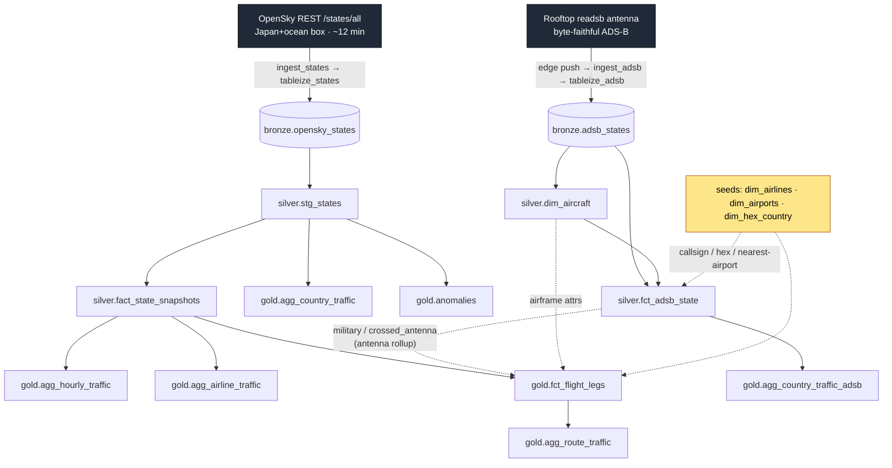
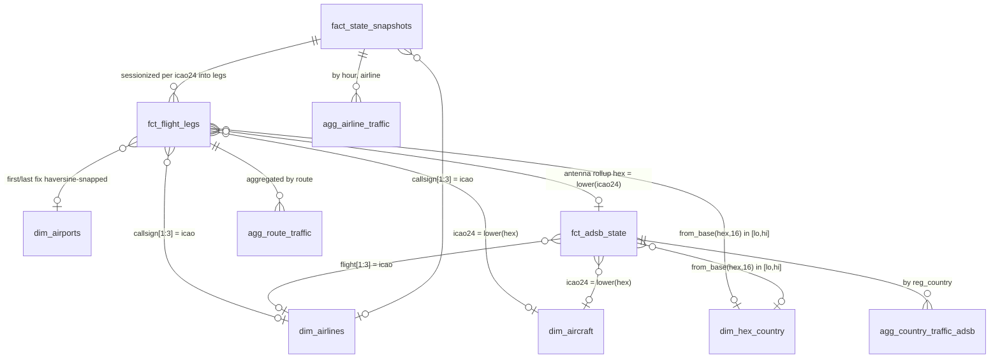

# Data lake schema

`sancha1090` is a local-first **medallion lakehouse** on Apache Iceberg (Garage S3 +
Polaris REST catalog + Trino). Raw observations land in **bronze**, are conformed and
typed in **silver**, and are aggregated into consumer-facing **gold** marts — all built
by dbt-on-Trino and orchestrated by Airflow asset chains.

It carries **two independent live feeds** that stay on separate refresh tracks and fuse
in exactly one place (`gold.fct_flight_legs`):

| Feed | Source | Bronze table | Coverage | Units |
|------|--------|--------------|----------|-------|
| **Context** (OpenSky) | OpenSky Network `/states/all` REST API, one Japan+ocean bbox, ~12-min cadence | `bronze.opensky_states` | Japan + surrounding ocean (beyond the antenna's horizon) | metres, m/s |
| **Rooftop** | A local `readsb` ADS-B antenna, byte-faithful records | `bronze.adsb_states` | the antenna's reception footprint (Tokyo area) | feet, knots |

This document is the column-level reference for the **states/ADS-B core** of the lake — the
two feeds above and the models built from them. Two newer lanes are **not yet documented here**:
the v5.1 flights lane (`bronze.opensky_flights`, `silver.dim_aircraft_registry`,
`gold.fact_flights`, `gold.agg_flight_routes`, `gold.longest_flights`,
`gold.agg_operator_traffic`, `gold.agg_airport_daily`) and the v5.2 archive-history lane
(`bronze.archive_states`, `silver.stg_states_history`, `gold.agg_hourly_traffic_history`,
`gold.agg_hourly_traffic_live_archive`) — see the dbt sources and models for those.

## Contents

- [Lineage](#lineage)
- [Entity map](#entity-map)
- [Refresh model — which DAG builds what](#refresh-model)
- [Bronze](#bronze) · [Silver](#silver) · [Gold](#gold)
- [Join keys & relationships](#join-keys--relationships)
- [Known limitations](#known-limitations)

## Lineage

The two tracks are deliberately separate so they each refresh on their own feed and never
race each other's writes. The only join point is `fct_flight_legs`, which reads the OpenSky
context fact for geometry and the rooftop tables for enrichment — see [fusion](#known-limitations).

## Entity map

Relationships across the modeled silver + gold core (bronze raw tables omitted). Edge
labels are the join predicates.

## Refresh model

Two Airflow DAGs, each asset-triggered on its feed's bronze table, partition the states-core
dbt graph by tag. `dim_*` seeds and rooftop models carry `tag:adsb`; the states core is
otherwise untagged. (The flights and archive-history lanes, not documented here, carry
`tag:flights` / `tag:history`.)

| Object | Built by | Trigger asset | dbt selection |
|--------|----------|---------------|---------------|
| `bronze.opensky_states` | `ingest_states` → `tableize_states` | — (produces `bronze_states_table`) | — |
| `bronze.adsb_states` | edge push → `ingest_adsb` → `tableize_adsb` | — (produces `adsb_bronze_table`) | — |
| `silver.stg_states` | `transform_marts` | `bronze_states_table` (OpenSky context) | `--exclude tag:adsb tag:flights` |
| `silver.fact_state_snapshots` | `transform_marts` | `bronze_states_table` | `--exclude tag:adsb tag:flights` |
| `gold.anomalies` | `transform_marts` | `bronze_states_table` | `--exclude tag:adsb tag:flights` |
| `gold.agg_country_traffic` | `transform_marts` | `bronze_states_table` | `--exclude tag:adsb tag:flights` |
| `gold.agg_hourly_traffic` | `transform_marts` | `bronze_states_table` | `--exclude tag:adsb tag:flights` |
| `gold.agg_airline_traffic` | `transform_marts` | `bronze_states_table` | `--exclude tag:adsb tag:flights` |
| `gold.fct_flight_legs` | `transform_marts` | `bronze_states_table` | `--exclude tag:adsb tag:flights` |
| `gold.agg_route_traffic` | `transform_marts` | `bronze_states_table` | `--exclude tag:adsb tag:flights` |
| `silver.dim_aircraft` | `transform_adsb_silver` | `adsb_bronze_table` (rooftop) | `--select tag:adsb` |
| `silver.fct_adsb_state` | `transform_adsb_silver` | `adsb_bronze_table` | `--select tag:adsb` |
| `silver.dim_airlines` / `dim_airports` / `dim_hex_country` (seeds) | `transform_adsb_silver` (`dbt seed`) | `adsb_bronze_table` | `tag:adsb` |
| `gold.agg_country_traffic_adsb` | `transform_adsb_silver` | `adsb_bronze_table` | `--select tag:adsb` |

> **Bootstrap note.** `fct_flight_legs` is untagged (so it refreshes on the OpenSky context feed) but
> reads `tag:adsb` relations (the dim seeds, `dim_aircraft`, `fct_adsb_state`). On a fresh
> deploy, run `transform_adsb_silver` once before `transform_marts`, or the build errors on a
> missing relation.

---

## Bronze

Raw, append-only, byte-faithful. Nothing is dropped here so silver/gold can re-derive
anything. Every column is nullable in both bronze tables.

### `bronze.opensky_states` — OpenSky context feed

- **Grain:** one row per `(icao24, snapshot_time, region)`. Since v5.0 there is a single
  `region` (`japan`); the silver dedup that collapsed overlapping-region duplicates stays in
  place (harmless with one box, and ready if sub-regions return).
- **Source:** OpenSky `/states/all`, fetched per geographic bounding box (`include/regions.py`) —
  one Japan+ocean box covering the airspace around the antenna and beyond its horizon.
- **Built by:** `ingest_states` (every 12 min, dynamic-mapped over the region list — currently
  one Japan+ocean box) → `tableize_states` (single canonical PyIceberg writer). Partitioned by
  `day(snapshot_time)`.

| Column | Type | Meaning |
|--------|------|---------|
| `icao24` | `varchar` | ICAO 24-bit address, lowercase hex. Airframe identity. |
| `callsign` | `varchar` | Broadcast callsign (may be trailing-space padded; null if not transmitted). |
| `origin_country` | `varchar` | Country OpenSky infers from the ICAO24 allocation block. |
| `time_position` | `timestamp(6) with time zone` | Time of the last position report; null if none yet. |
| `last_contact` | `timestamp(6) with time zone` | Time of the last message of any kind. |
| `longitude` | `double` | WGS-84 longitude, degrees (null if unknown). |
| `latitude` | `double` | WGS-84 latitude, degrees (null if unknown). |
| `baro_altitude` | `double` | Barometric altitude in **metres**. |
| `on_ground` | `boolean` | True if reported on the ground (surface position). |
| `velocity` | `double` | Ground speed in **m/s**. |
| `true_track` | `double` | True track over ground, degrees clockwise from north. |
| `vertical_rate` | `double` | Vertical rate in m/s (positive = climb). |
| `geo_altitude` | `double` | Geometric (GNSS) altitude in metres. |
| `squawk` | `varchar` | Mode-A squawk code (string; null if not transmitted). |
| `spi` | `boolean` | Special Position Identification (ident) flag. **Boolean** here. |
| `position_source` | `integer` | 0=ADS-B, 1=ASTERIX, 2=MLAT, 3=FLARM (OpenSky enum). |
| `snapshot_time` | `timestamp(6) with time zone` | Time OpenSky sampled the state. Partition key + primary time axis. |
| `region` | `varchar` | Bounding-box region the row was fetched under. **Part of the grain.** |
| `ingested_at` | `timestamp(6) with time zone` | Airflow logical date of the ingest run. |
| `committed_at` | `timestamp(6) with time zone` | Wall-clock time the row was appended to Iceberg. |

> Three distinct timestamps — `snapshot_time` (sampled), `ingested_at` (fetched),
> `committed_at` (written) — do not conflate them. Always filter `snapshot_time` for partition
> pruning.

### `bronze.adsb_states` — rooftop feed

- **Grain:** one row per `readsb` sample, effectively `(hex, capture_ts)`. No dedup at bronze.
- **Source:** a local antenna's `readsb`/`tar1090` records, mirrored verbatim.
- **Built by:** the edge unit `rclone`-pushes Parquet bundles to Garage; `ingest_adsb` (hourly)
  records each to a Postgres manifest; `tableize_adsb` registers the producer Parquet **in place**
  (zero-copy `add_files`, not a rewrite). Unpartitioned — always constrain `capture_ts` for pruning.
- **Notes:** all 60 columns nullable (the byte-mirror path cannot promote a nullable Parquet
  column to required). `desc` is a **reserved word** — always double-quote it. `alt_baro`/`year`
  are intentionally strings. `spi` is `bigint` here (vs `boolean` in the OpenSky context feed). `_raw_json`
  holds the full verbatim record and is the source of truth for any field not promoted to a typed
  column (e.g. `dbFlags`).

<b>All 60 columns</b>

| Column | Type | Meaning |
|--------|------|---------|
| `capture_ts` | `double` | Edge capture time, epoch seconds. Primary time axis + pruning key. |
| `hex` | `varchar` | ICAO 24-bit address, lowercase hex. Airframe identity (only `not_null`-tested column). |
| `type` | `varchar` | `readsb` message/position type (e.g. `adsb_icao`, `mlat`, `tisb_other`). |
| `r` | `varchar` | Aircraft registration / tail (readsb DB lookup). |
| `t` | `varchar` | ICAO type designator (e.g. `B738`). |
| `desc` | `varchar` | Human-readable type description. **Reserved word — quote as `"desc"`.** |
| `category` | `varchar` | ADS-B emitter category (A1–A7, B-class…). |
| `sil_type` | `varchar` | Whether SIL is per-hour or per-sample. |
| `emergency` | `varchar` | Emergency/priority status string. |
| `ownop` | `varchar` | Owner/operator name (producer field `ownOp`, lowercased here). |
| `year` | `varchar` | Build/registration year (kept raw as string). |
| `flight` | `varchar` | Callsign/flight as broadcast (often trailing-space padded). |
| `squawk` | `varchar` | Mode-A squawk (4 octal digits) as string. |
| `alt_baro` | `varchar` | Barometric altitude in **feet** — **string** because it can be the literal `'ground'`. |
| `now` | `double` | readsb's own `now` timestamp for the source snapshot. |
| `lat` | `double` | Latitude, degrees. |
| `lon` | `double` | Longitude, degrees. |
| `r_dst` | `double` | Range from the receiver (nautical miles). |
| `r_dir` | `double` | Bearing from the receiver (degrees). |
| `seen` | `double` | Seconds since last seen on any message. |
| `seen_pos` | `double` | Seconds since last position update. |
| `rssi` | `double` | Signal strength (dBFS). |
| `gs` | `double` | Ground speed (**knots**). |
| `mach` | `double` | Mach number, when broadcast. |
| `track` | `double` | Ground track (degrees true). |
| `track_rate` | `double` | Rate of change of track (deg/s). |
| `roll` | `double` | Roll angle (deg; negative = left bank). |
| `mag_heading` | `double` | Magnetic heading (deg). |
| `true_heading` | `double` | True heading (deg). |
| `nav_qnh` | `double` | Selected QNH/altimeter (hPa). |
| `nav_heading` | `double` | Selected/MCP heading (deg). |
| `messages` | `bigint` | Total Mode-S messages this session (counter). |
| `nic` | `bigint` | Navigation Integrity Category. |
| `rc` | `bigint` | Radius of Containment (m) for the NIC. |
| `version` | `bigint` | ADS-B version (0/1/2). |
| `nac_p` | `bigint` | Navigation Accuracy Category — Position. |
| `nac_v` | `bigint` | Navigation Accuracy Category — Velocity. |
| `sil` | `bigint` | Source Integrity Level value. |
| `nic_baro` | `bigint` | NIC for barometric altitude (cross-check flag). |
| `gva` | `bigint` | Geometric Vertical Accuracy category. |
| `sda` | `bigint` | System Design Assurance level. |
| `alert` | `bigint` | Mode-S alert/ident flag. |
| `spi` | `bigint` | Ident flag. **`bigint` (0/1)** here, vs boolean in the OpenSky context feed. |
| `alt_geom` | `bigint` | Geometric (GNSS) altitude (feet). |
| `ias` | `bigint` | Indicated airspeed (knots). |
| `tas` | `bigint` | True airspeed (knots). |
| `baro_rate` | `bigint` | Barometric vertical rate (ft/min). |
| `geom_rate` | `bigint` | Geometric vertical rate (ft/min). |
| `nav_altitude_mcp` | `bigint` | Selected altitude from the MCP/FCU (feet). |
| `nav_altitude_fms` | `bigint` | Selected altitude from the FMS (feet). |
| `wd` | `bigint` | Derived wind direction (deg). |
| `ws` | `bigint` | Derived wind speed (knots). |
| `oat` | `bigint` | Outside air temperature (°C). |
| `tat` | `bigint` | Total air temperature (°C). |
| `nav_modes` | `array(varchar)` | Engaged autopilot/nav modes. |
| `mlat` | `array(varchar)` | Fields derived via multilateration. |
| `tisb` | `array(varchar)` | Fields sourced from TIS-B. |
| `acas_ra` | `varchar` | ACAS/TCAS resolution advisory, raw JSON string. |
| `_raw_json` | `varchar` | The verbatim source record. Ground truth; carries un-promoted fields (e.g. `dbFlags`). |
| `_schema_version` | `integer` | Producer schema-contract version. |

---

## Silver

Cleaned, typed, conformed. Facts are row-grain analytical tables; dims are conformed lookups
shared across both feeds.

### `silver.stg_states` — staging (OpenSky context)

- **Grain:** one row per `(icao24, snapshot_time)` — deduped OpenSky context state vector.
- **Notes:** scans only the last **30 days** of bronze (retention mirror), so it is not full
  history. Dedup keeps the row with the latest `ingested_at` per grain. All measures nullable.
  Columns `geo_altitude_m`, `squawk`, `spi`, `position_source`, `time_position`, `last_contact`,
  `ingested_at` exist here but are **not** carried into `fact_state_snapshots`.

| Column | Type | Meaning |
|--------|------|---------|
| `icao24` | `varchar` | ICAO 24-bit address (lowercase hex). Grain key. |
| `callsign` | `varchar` | Trimmed callsign; blank normalized to NULL. |
| `origin_country` | `varchar` | OpenSky registration country. |
| `time_position` | `timestamp(6) with time zone` | Last position report time. |
| `last_contact` | `timestamp(6) with time zone` | Last message time. |
| `longitude` | `double` | WGS-84 longitude. |
| `latitude` | `double` | WGS-84 latitude. |
| `baro_altitude_m` | `double` | Barometric altitude, metres (renamed from bronze). |
| `on_ground` | `boolean` | On-ground flag. |
| `velocity_mps` | `double` | Ground speed, m/s. |
| `track_deg` | `double` | True track, degrees. |
| `vertical_rate_mps` | `double` | Vertical rate, m/s. |
| `geo_altitude_m` | `double` | Geometric altitude, metres. |
| `squawk` | `varchar` | Mode-A squawk. |
| `spi` | `boolean` | Ident flag. |
| `position_source` | `integer` | Position origin enum (0–3). |
| `snapshot_time` | `timestamp(6) with time zone` | Poll capture time. Grain key. |
| `region` | `varchar` | Polling region label. |
| `ingested_at` | `timestamp(6) with time zone` | Bronze landing time; dedup tiebreaker (latest wins). |

### `silver.fact_state_snapshots` — OpenSky context movement fact

- **Grain:** one row per `(icao24, snapshot_time)`, **positioned only** (lat/lon non-null).
- **Notes:** strict subset of `stg_states` (filters NULL position); inherits the 30-day window.
  Iceberg PARQUET, partitioned by `day(snapshot_time)`, sorted `snapshot_time DESC`. Base of the
  OpenSky-context-feed gold marts.

| Column | Type | Meaning |
|--------|------|---------|
| `icao24` | `varchar` | ICAO 24-bit address. Grain key; fuses to `fct_adsb_state.hex` via `lower()`. |
| `snapshot_time` | `timestamp(6) with time zone` | Poll capture time. Grain + partition/sort key. |
| `region` | `varchar` | Polling region label. |
| `callsign` | `varchar` | Trimmed callsign; NULL when blank. |
| `origin_country` | `varchar` | OpenSky registration country. |
| `longitude` | `double` | WGS-84 longitude (always non-null here). |
| `latitude` | `double` | WGS-84 latitude (always non-null here). |
| `baro_altitude_m` | `double` | Barometric altitude, metres. |
| `velocity_mps` | `double` | Ground speed, m/s. |
| `track_deg` | `double` | True track, degrees. |
| `vertical_rate_mps` | `double` | Vertical rate, m/s. |
| `on_ground` | `boolean` | On-ground flag; drives leg-splitting in `fct_flight_legs`. |
| `snapshot_hour` | `timestamp(6) with time zone` | `date_trunc('hour', snapshot_time)`. |

### `silver.fct_adsb_state` — rooftop observation fact

- **Grain:** one row per rooftop ADS-B observation — **row-count-preserving** over
  `bronze.adsb_states` (every enrichment join is LEFT and single-valued).
- **Notes:** decodes `readsb` `dbFlags` (read from `_raw_json`) into four 2-valued booleans —
  `COALESCE(...,0)` keeps them TRUE/FALSE (absence = FALSE, never NULL), so they survive `GROUP BY`
  and percentage math. The airline join answers "airline of *this flight*" (codeshare/leasing
  aware), distinct from the airframe owner.

| Column | Type | Meaning |
|--------|------|---------|
| `capture_ts` | `double` | Observation capture time, epoch seconds (from bronze). |
| `hex` | `varchar` | ICAO 24-bit address; may carry a `~` prefix for non-ICAO (TIS-B/ADS-R) addresses. |
| `flight` | `varchar` | Callsign from the Mode-S frame. |
| `lat` | `double` | WGS-84 latitude. |
| `lon` | `double` | WGS-84 longitude. |
| `alt_baro` | `varchar` | Barometric altitude — **string** (can be `'ground'`). |
| `gs` | `double` | Ground speed (**knots**). |
| `track` | `double` | True track, degrees. |
| `is_military` | `boolean` | `dbFlags` bit 1 — military airframe. 2-valued. |
| `is_interesting` | `boolean` | `dbFlags` bit 2 — flagged "interesting" in the readsb DB. 2-valued. |
| `is_pia` | `boolean` | `dbFlags` bit 4 — PIA (Privacy ICAO Address). 2-valued. |
| `is_ladd` | `boolean` | `dbFlags` bit 8 — LADD opt-out. 2-valued. |
| `registration` | `varchar` | Tail from `dim_aircraft`; NULL if airframe unknown. |
| `typecode` | `varchar` | Type designator from `dim_aircraft`; NULL if unknown. |
| `category` | `varchar` | Emitter category from `dim_aircraft`. |
| `airline_name` | `varchar` | Operating airline (callsign ICAO-3 prefix → `dim_airlines`). |
| `airline_country` | `varchar` | Country of the operating airline. |
| `reg_country` | `varchar` | Registration country (hex-block lookup via `dim_hex_country`). |

### `silver.dim_aircraft` — airframe dimension

- **Grain:** one row per airframe, keyed by lowercase hex (`icao24`), unique not-null.
- **Source:** collapsed from `bronze.adsb_states` (rooftop-derived) via `max_by(col, capture_ts)`
  over non-null samples (latest known value wins; a later NULL never blanks a known field).
- **Notes:** the airframe list is antenna-derived (only rooftop-seen hexes get a row). Since
  v5.1, `registration`/`typecode` are backfilled from `dim_aircraft_registry` (registry wins
  where present), and that join adds registry columns (`operator`, `owner`, `model`,
  `manufacturer`, `country_of_registration`) not listed below.

| Column | Type | Meaning |
|--------|------|---------|
| `icao24` | `varchar` | `lower(hex)` — unique airframe key. |
| `registration` | `varchar` | Tail number (latest non-null sample). |
| `typecode` | `varchar` | ICAO type designator. |
| `aircraft_desc` | `varchar` | Human-readable description (from bronze `"desc"`). Not exposed in `fct_adsb_state`. |
| `category` | `varchar` | ADS-B emitter category. |
| `operator_raw` | `varchar` | Raw owner/operator (sparse, ~18%); **not** the airline source. |

### `silver.dim_airlines` — airline dimension (seed)

- **Grain:** one row per airline ICAO 3-letter designator, unique not-null.
- **Source:** OpenFlights `airlines.dat` → `scripts/build_dim_airlines.py` (Type-1, active-wins
  dedup). Loaded as a dbt seed.
- **Notes:** the callsign-prefix join answers "operating airline of this flight"; many GA flights
  have no match (`airline_name` NULL by design). OpenFlights `\N` → empty string (not NULL).

| Column | Type | Meaning |
|--------|------|---------|
| `icao` | `varchar` | ICAO 3-letter designator (e.g. `ANA`, `JAL`). Unique PK. |
| `iata` | `varchar` | IATA 2-char code. |
| `name` | `varchar` | Airline name (e.g. `All Nippon Airways`). |
| `callsign` | `varchar` | Radio/telephony callsign (e.g. `ALL NIPPON`). |
| `country` | `varchar` | Country of registration. |
| `active` | `varchar` | `Y`/`N` activity flag (string). |

### `silver.dim_airports` — airport dimension (seed)

- **Grain:** one row per airport ICAO 4-letter code, unique not-null.
- **Source:** OpenFlights `airports.dat` → `scripts/build_dim_airports.py` (first-occurrence-wins;
  the builder refuses to overwrite the seed if it parses 0 airports).
- **Notes:** `lat`/`lon` power the nearest-airport haversine snap of leg endpoints in
  `fct_flight_legs`. Anchor airports always present: RJTT, RJAA, KJFK, EGLL.

| Column | Type | Meaning |
|--------|------|---------|
| `icao` | `varchar` | ICAO 4-letter code (e.g. `RJTT`). Unique PK (only `^[A-Z]{4}$` kept). |
| `iata` | `varchar` | IATA 3-char code. |
| `name` | `varchar` | Airport name. |
| `city` | `varchar` | City served. |
| `country` | `varchar` | Country. |
| `lat` | `double` | Latitude, degrees. |
| `lon` | `double` | Longitude, degrees. |

### `silver.dim_hex_country` — registration-country range table (seed)

- **Grain:** one row per **disjoint** ICAO 24-bit address block `[block_lo, block_hi] → country`.
- **Source:** `tar1090` `flags.js` → `scripts/build_dim_hex_country.py`, flattened so the
  deliberately-overlapping source ranges (most-specific wins, e.g. Bermuda/Hong Kong carve-outs)
  become a disjoint partition — exactly one row matches any hex, so the fact never fans out.
- **Notes:** it's a **range join**, not an equality PK. `block_lo`/`block_hi` are decimal integers.
  Unallocated gaps produce no row → NULL country in the LEFT join (correct).

| Column | Type | Meaning |
|--------|------|---------|
| `block_lo` | `bigint` | Inclusive lower bound of the block (decimal integer). |
| `block_hi` | `bigint` | Inclusive upper bound of the block. |
| `country` | `varchar` | Country/territory for any hex in `[block_lo, block_hi]`. |

---

## Gold

Consumer-facing marts. The four **v3.5** marts (`fct_flight_legs`, `agg_route_traffic`,
`agg_airline_traffic`, `agg_country_traffic_adsb`) are documented first; three **legacy**
OpenSky-context marts follow.

### `gold.fct_flight_legs` — inferred flight legs (headline)

- **Grain:** one row per `(icao24, leg_id)` — one inferred flight leg per airframe.
- **Source:** **cross-feed** — OpenSky context `fact_state_snapshots` for geometry, fused with rooftop
  `fct_adsb_state` + dims for enrichment.
- **What it does:** sessionizes each airframe's OpenSky context state stream into legs (a new leg on a
  `> 90-min` sample gap or an `on_ground` true-flip), then snaps low-altitude (`< 3000 m`)
  first/last fixes to the nearest airport (haversine `≤ 100 km`) to infer origin/dest.
- **Notes:** `route_inferred` is **approximate, not authoritative** — the ~12-min cadence snaps
  to the first/last *in-coverage* fix, not the runway; transoceanic legs fragment into
  one-endpoint-NULL halves. dbt tests: `not_null icao24`, `unique (icao24, leg_id)`, and no
  endpoint snapped above cruise altitude.

| Column | Type | Meaning |
|--------|------|---------|
| `icao24` | `varchar` | Airframe ICAO 24-bit address. Grain key. |
| `leg_id` | `bigint` | Sequential leg index per airframe (running sum of leg-break flags). Grain key. |
| `callsign` | `varchar` | Dominant callsign for the leg (most frequent; ties broken earliest-seen then lexical — deterministic). |
| `start_time` | `timestamp(6) with time zone` | Earliest airborne-fix time in the leg. |
| `end_time` | `timestamp(6) with time zone` | Latest airborne-fix time. |
| `duration_min` | `bigint` | Minutes between `start_time` and `end_time`. |
| `num_fixes` | `bigint` | Count of airborne fixes in the leg. |
| `first_lat` / `first_lon` | `double` | First airborne fix position. |
| `first_alt_m` | `double` | Altitude at the first fix; gates the origin snap (`< 3000 m`). |
| `last_lat` / `last_lon` | `double` | Last airborne fix position. |
| `last_alt_m` | `double` | Altitude at the last fix; gates the dest snap. |
| `origin_icao` | `varchar` | Nearest airport to the first fix within 100 km **iff** low-altitude; else NULL (overflight). |
| `origin_name` | `varchar` | Snapped origin airport name. |
| `origin_lat` / `origin_lon` | `double` | Snapped origin coordinates. |
| `dest_icao` | `varchar` | Nearest airport to the last fix within 100 km **iff** low-altitude; else NULL. |
| `dest_name` | `varchar` | Snapped destination airport name. |
| `dest_lat` / `dest_lon` | `double` | Snapped destination coordinates. |
| `route_inferred` | `varchar` | `origin_icao-dest_icao` when both resolve, else NULL. **Inferred**, not authoritative. |
| `registration` | `varchar` | Tail from `dim_aircraft` (sparse — antenna-derived). |
| `typecode` | `varchar` | Type code from `dim_aircraft` (sparse). |
| `airline_name` | `varchar` | Operating airline (callsign prefix → `dim_airlines`). |
| `airline_country` | `varchar` | Country of the operating airline. |
| `reg_country` | `varchar` | Registration country (hex-block lookup). |
| `is_military` | `boolean` | Military flag from the rooftop rollup; `false` if never seen by the antenna. |
| `crossed_antenna` | `boolean` | True if this airframe appears in the rooftop feed. |

### `gold.agg_route_traffic` — top inferred routes

- **Grain:** one row per resolved route (`origin != dest`), derived 1:N from `fct_flight_legs`.
- **Purpose:** busiest origin→dest routes by frequency, with both endpoints' coordinates for a
  deck.gl arc map.
- **Notes:** only both-endpoints-resolved legs are ranked, and self-loops (`origin == dest`) are
  filtered out. Transoceanic legs fragment and never appear here, so the leaderboard skews
  intra-continental; for authoritative airport pairs use the v5.1 flights lane
  (`fact_flights` / `agg_flight_routes`) — this mart is not reconciled against it.

| Column | Type | Meaning |
|--------|------|---------|
| `route_inferred` | `varchar` | `origin_icao-dest_icao` (e.g. `RJTT-RJAA`). Grain; not-null. |
| `origin_icao` | `varchar` | Origin airport ICAO. |
| `origin_name` | `varchar` | Origin airport name. |
| `origin_lat` / `origin_lon` | `double` | Origin coordinates (arc start). |
| `dest_icao` | `varchar` | Destination airport ICAO. |
| `dest_name` | `varchar` | Destination airport name. |
| `dest_lat` / `dest_lon` | `double` | Destination coordinates (arc end). |
| `leg_count` | `bigint` | Number of legs on this route (sort key). |
| `distinct_aircraft` | `bigint` | Distinct airframes flown on this route. |
| `last_seen` | `timestamp(6) with time zone` | Most recent leg `end_time` on this route. |

### `gold.agg_airline_traffic` — hourly airline leaderboard

- **Grain:** one row per `(snapshot_hour, airline_name, airline_country)`.
- **Purpose:** distinct airframes per airline per hour, straight from the OpenSky-context-feed callsign.
- **Notes:** **inner** join to `dim_airlines` — only callsigns matching the GA-tail guard with a
  known ICAO prefix survive; GA/private and unresolved callsigns are excluded.

| Column | Type | Meaning |
|--------|------|---------|
| `snapshot_hour` | `timestamp(6) with time zone` | Hour bucket. Grain key. |
| `airline_name` | `varchar` | Airline resolved from the callsign prefix. |
| `airline_country` | `varchar` | Country of the airline. |
| `distinct_aircraft` | `bigint` | Distinct airframes for that airline that hour. |
| `observations` | `bigint` | Total state rows for that airline that hour. |

### `gold.agg_country_traffic_adsb` — rooftop by registration country

- **Grain:** one row per `reg_country`. **Built on the rooftop DAG** (`tag:adsb`), so it stays in
  sync with the rooftop feed, not the OpenSky context feed.
- **Purpose:** the deliberate rooftop-feed mirror of the OpenSky context `agg_country_traffic`.
- **Notes:** coverage is the antenna footprint (Tokyo area), so Japan dominates.

| Column | Type | Meaning |
|--------|------|---------|
| `reg_country` | `varchar` | Registration country (hex-block lookup). Grain key; not-null + unique. |
| `distinct_aircraft` | `bigint` | Distinct airframes seen by the rooftop for this country. |
| `observations` | `bigint` | Total rooftop ADS-B rows for this country. |
| `military_observations` | `bigint` | Count of `is_military` observations. |

### Legacy OpenSky-context marts

These predate v3.5 and are listed in `maintain_iceberg_marts` for OPTIMIZE compaction.

#### `gold.agg_country_traffic` — country leaderboard (latest snapshot)

- **Grain:** one row per `origin_country`. **Latest ~5-min window only** (a point-in-time
  snapshot that overwrites each OpenSky context tick), not full history.

| Column | Type | Meaning |
|--------|------|---------|
| `origin_country` | `varchar` | OpenSky registration country. Grain key; not-null + unique. |
| `airborne_aircraft` | `bigint` | Distinct airborne aircraft from that country in the latest snapshot. |
| `avg_speed_kmh` | `decimal(10,2)` | Average ground speed, km/h. |
| `avg_altitude_m` | `decimal(10,2)` | Average barometric altitude, metres. |
| `snapshot_ts` | `timestamp(6) with time zone` | As-of timestamp the leaderboard reflects. |

#### `gold.agg_hourly_traffic` — hourly time series

- **Grain:** one row per `snapshot_hour`. Full-history rollup.

| Column | Type | Meaning |
|--------|------|---------|
| `snapshot_hour` | `timestamp(6) with time zone` | Hour bucket. Grain key; not-null + unique. |
| `unique_aircraft` | `bigint` | Distinct `icao24` that hour. |
| `total_observations` | `bigint` | Total state rows that hour. |
| `airborne_observations` | `bigint` | Observations with `on_ground = false`. |
| `on_ground_observations` | `bigint` | Observations with `on_ground = true`. |
| `avg_airborne_speed_kmh` | `decimal(10,2)` | Average airborne ground speed, km/h. |

#### `gold.anomalies` — data-quality monitor

- **Grain:** one row per state observation that violates a physical-plausibility range check.
- **Notes:** only the first matching rule per row is reported (CASE precedence). A dbt
  `accepted_values` test pins the `anomaly_type` domain.

| Column | Type | Meaning |
|--------|------|---------|
| `icao24` | `varchar` | Aircraft of the flagged observation. |
| `callsign` | `varchar` | Callsign (nullable). |
| `origin_country` | `varchar` | Registration country. |
| `snapshot_time` | `timestamp(6) with time zone` | Time of the flagged observation. |
| `latitude` / `longitude` | `double` | Position (may itself be the out-of-range value). |
| `baro_altitude_m` | `double` | Barometric altitude (may be out of range). |
| `velocity_mps` | `double` | Ground velocity (may be out of range). |
| `anomaly_type` | `varchar` | Rule fired: `altitude_too_high` (>15000 m), `altitude_below_sea_level` (<−500 m), `velocity_too_high` (>350 m/s), `negative_velocity`, `invalid_latitude`, `invalid_longitude`. |

---

## Join keys & relationships

| From | To | On | Kind |
|------|----|----|------|
| `fct_adsb_state` (`hex`) | `dim_aircraft` | `icao24 = lower(hex)` | LEFT, single-valued |
| `fct_adsb_state` (`flight`) | `dim_airlines` | `icao = substr(trim(flight),1,3)` + `^[A-Z]{3}[0-9]` guard | LEFT |
| `fct_adsb_state` (`hex`) | `dim_hex_country` | `try(from_base(lower(hex),16)) BETWEEN block_lo AND block_hi` | LEFT range |
| `fact_state_snapshots` (`callsign`) | `dim_airlines` | `icao = substr(trim(callsign),1,3)` + guard | INNER (in `agg_airline_traffic`) |
| `fct_flight_legs` (`first/last fix`) | `dim_airports` | nearest-airport haversine `≤ 100 km`, low-altitude only | LEFT, `row_number()=1` |
| `fct_flight_legs` (`icao24`) | `dim_aircraft` | `icao24 = lower(icao24)` | LEFT (cross-feed) |
| `fct_flight_legs` (`callsign`) | `dim_airlines` | `icao = substr(trim(callsign),1,3)` + guard | LEFT |
| `fct_flight_legs` (`icao24`) | `dim_hex_country` | `try(from_base(lower(icao24),16)) BETWEEN ...` | LEFT range |
| `fct_flight_legs` (`icao24`) | `fct_adsb_state` (antenna rollup) | `hex = lower(icao24)` | LEFT (cross-feed fusion) |
| `agg_route_traffic` | `fct_flight_legs` | grouped by `route_inferred` | derived 1:N |
| **cross-feed identity** | | `fct_adsb_state.hex = lower(fact_state_snapshots.icao24)` | rooftop ↔ OpenSky |

## Known limitations

- **Inferred routes ≠ ground truth.** `fct_flight_legs.route_inferred` is reconstructed from a
  ~12-min sampled feed and snaps to the nearest in-coverage airport, not the actual runway.
  Authoritative origin/dest from OpenSky arrival/departure data lives in the v5.1 flights lane
  (`fact_flights`); `route_inferred` is not reconciled against it.
- **Transoceanic fragmentation.** Long-haul flights that leave coverage mid-ocean split into two
  legs, each with one NULL endpoint, so they're excluded from `agg_route_traffic` — which skews
  the leaderboard toward intra-continental routes.
- **Sparse airframe enrichment.** `dim_aircraft` only has rows for airframes the rooftop has
  seen, so cross-feed enrichment in `fct_flight_legs` stays NULL for everything else. For
  rooftop-seen airframes, the v5.1 global registry (`dim_aircraft_registry`) backfills
  `registration`/`typecode`.
- **Cross-feed lag + bootstrap.** `fct_flight_legs` geometry is fresh every OpenSky context tick, but its
  rooftop enrichment (`is_military`, `crossed_antenna`) can lag by up to one OpenSky-context-tick interval;
  and on a fresh deploy `transform_adsb_silver` must run once before `transform_marts`.
- **Legacy `agg_country_traffic` is point-in-time** — a latest-5-min snapshot, not full history.
