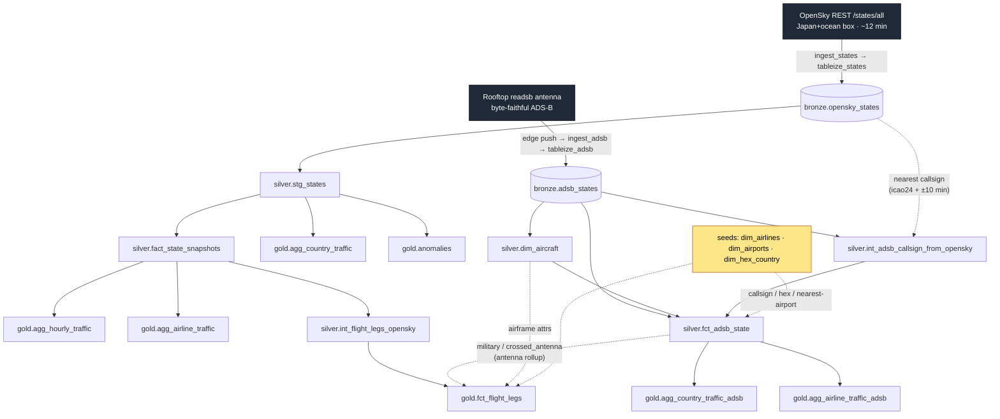
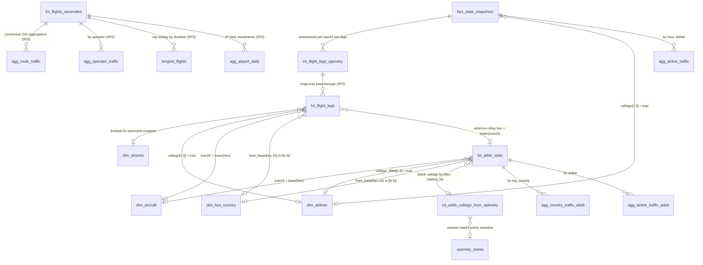

# Data lake schema

`sancha1090` is a local-first **medallion warehouse** on ClickHouse, fed from the Parquet
landing zone in Garage S3. Raw observations land in **bronze**, are conformed and typed in
**silver**, and are aggregated into consumer-facing **gold** marts — all built by
dbt-clickhouse and orchestrated by Airflow asset chains. (The physical ClickHouse schemas
are `bronze`, `silver_ch`, and `gold_ch`; this reference uses the conceptual layer names.
Column types are shown in SQL-standard form. Previously an Iceberg+Polaris+Trino lakehouse —
see the v5.12 tag and the README "Architecture evolution".)

It carries **two independent live feeds** that stay on separate refresh tracks and fuse
where one feed enriches the other — the OpenSky callsign backfill into `silver.fct_adsb_state`
and the geometry/enrichment join in `gold.fct_flight_legs`:

| Feed | Source | Bronze table | Coverage | Units |
|------|--------|--------------|----------|-------|
| **Context** (OpenSky) | OpenSky Network `/states/all` REST API, one Japan+ocean bbox, ~12-min cadence | `bronze.opensky_states` | Japan + surrounding ocean (beyond the antenna's horizon) | metres, m/s |
| **Rooftop** | A local `readsb` ADS-B antenna, byte-faithful records | `bronze.adsb_states` | the antenna's reception footprint (Tokyo area) | feet, knots |

This document is the column-level reference for the **states/ADS-B core** of the lake — the
two feeds above and the models built from them. Two newer lanes are **not yet documented here**:
the v5.1 flights lane (`bronze.opensky_flights`, `silver.dim_aircraft_registry`,
`gold.fact_flights`) and the v5.2 adsb.lol history lane
(`bronze.adsblol_states`, `silver.stg_states_adsblol`, whose hourly history is folded straight
into the self-maintaining `gold.agg_hourly_traffic` MV) — see the dbt sources and models for those. The
newer SP1/SP2 reconcile lane, which reads outputs of both, **is** documented — see
[Reconcile — cross-source consensus](#reconcile--cross-source-consensus-sp1). **SP3b** added a
fourth reconcile input, FAA SWIM (`bronze.swim_flightdata`), plus its LADD privacy-list companion
(`dim.dim_ladd`) — both are reconcile-lane concerns and documented there too, not treated as a
fifth undocumented lane. SP2 made
`gold.fct_flights_reconciled` the canonical O/D source: `gold.agg_route_traffic` (documented in
[Gold](#gold) below), `gold.agg_operator_traffic`, `gold.longest_flights`, and
`gold.agg_airport_daily` were all rebuilt on it (`tag:reconcile`, built by `transform_marts`),
and the old split-lane `gold.agg_flight_routes` is retired.

## Contents

- [Lineage](#lineage)
- [Entity map](#entity-map)
- [Refresh model — which DAG builds what](#refresh-model)
- [Bronze](#bronze) · [Silver](#silver) · [Gold](#gold)
- [Reconcile — cross-source consensus (SP1)](#reconcile--cross-source-consensus-sp1)
- [Join keys & relationships](#join-keys--relationships)
- [Known limitations](#known-limitations)

## Lineage



The two tracks are deliberately separate so they each refresh on their own feed and never
race each other's writes. They fuse in two read-only spots: the OpenSky callsign backfill into
`silver.fct_adsb_state` (recovering blank rooftop callsigns from the context feed), and
`gold.fct_flight_legs`, which reads the OpenSky context fact for geometry and the rooftop tables
for enrichment — see [fusion](#known-limitations).

## Entity map

Relationships across the modeled silver + gold core (bronze raw tables omitted). Edge
labels are the join predicates.



## Refresh model

Two Airflow DAGs, each asset-triggered on its feed's bronze table, partition the states-core
dbt graph by tag. `dim_*` seeds and rooftop models carry `tag:adsb`; the states core is
otherwise untagged. (The flights and adsb.lol history lanes, not documented here, carry
`tag:flights` / `tag:adsblol`.)

| Object | Built by | Trigger asset | dbt selection |
|--------|----------|---------------|---------------|
| `bronze.opensky_states` | `ingest_states` → `tableize_states` | — (produces `bronze_states_table`) | — |
| `bronze.adsb_states` | edge push → `ingest_adsb` → `tableize_adsb` | — (produces `adsb_bronze_table`) | — |
| `silver.stg_states` | `transform_marts` | `bronze_states_table` (OpenSky context) | `--exclude tag:adsb tag:flights` |
| `silver.fact_state_snapshots` | `transform_marts` | `bronze_states_table` | `--exclude tag:adsb tag:flights` |
| `gold.anomalies` | `transform_marts` | `bronze_states_table` | `--exclude tag:adsb tag:flights` |
| `gold.agg_country_traffic` | `transform_marts` | `bronze_states_table` | `--exclude tag:adsb tag:flights` |
| `gold.agg_hourly_traffic` | `ensure_ch_mvs` (in `transform_marts`) | continuous MV + `bronze_states_table` re-ensure | — (self-maintaining `*_acc` MV, `include/ch_incremental_mvs.py`) |
| `gold.agg_airline_traffic` | `ensure_ch_mvs` (in `transform_marts`) | continuous MV + `bronze_states_table` re-ensure | — (self-maintaining `*_acc` MV, `include/ch_incremental_mvs.py`) |
| `gold.fct_flight_legs` | `transform_marts` | `bronze_states_table` | `--exclude tag:adsb tag:flights` |
| `gold.agg_route_traffic` | `transform_marts` | `bronze_states_table` | `--exclude tag:adsb tag:flights` |
| `silver.dim_aircraft` | `transform_adsb_silver` | `adsb_bronze_table` (rooftop) | `--select tag:adsb` |
| `silver.fct_adsb_state` | `transform_adsb_silver` | `adsb_bronze_table` | `--select tag:adsb` |
| `silver.int_adsb_callsign_from_opensky` | `transform_adsb_silver` | `adsb_bronze_table` | `--select tag:adsb` |
| `silver.dim_airlines` / `dim_hex_country` / `dim_route_overrides` (seeds) | `clickhouse-marts-init` / `scripts/ch_setup_marts.sh` (`dbt seed`) | deploy/bootstrap | `--select tag:adsb dim_route_overrides --exclude dim_airports` |
| `silver.dim_airports` (seed) | `clickhouse-marts-init` / `scripts/ch_setup_marts.sh` (`dbt seed`) | deploy/bootstrap | `--full-refresh --select dim_airports` |
| `gold.agg_country_traffic_adsb` | `ensure_ch_mvs` (in `transform_marts`) | continuous MV + `bronze_states_table` re-ensure | — (self-maintaining `*_acc` MV, `include/ch_incremental_mvs.py`) |
| `gold.agg_airline_traffic_adsb` | `ensure_ch_mvs` (in `transform_marts`) | continuous MV + `bronze_states_table` re-ensure | — (self-maintaining `*_acc` MV, `include/ch_incremental_mvs.py`) |

`dim_airports` is split because it is the schema-changed 9-column seed; the other seeds are
schema-stable and take a plain `dbt seed`.

The four `agg_*` rows above are **not dbt models** — they are served by the self-maintaining
ClickHouse `*_acc` `AggregatingMergeTree` MVs in `include/ch_incremental_mvs.py`, which fire
continuously on each bronze insert; the `ensure_ch_mvs` task in `transform_marts` only idempotently
(re)creates the MV + serving view on the `bronze_states_table` tick.

> **Bootstrap note.** `fct_flight_legs` is untagged (so it refreshes on the OpenSky context feed) but
> reads `tag:adsb` relations (the dim seeds, `dim_aircraft`, `fct_adsb_state`). On a fresh
> deploy, run the seed bootstrap (`clickhouse-marts-init` or `scripts/ch_setup_marts.sh`) and
> `transform_adsb_silver` once before `transform_marts`, or the build errors on a missing relation.
> On a redeploy over an existing warehouse, `dim_airports` still needs the scoped
> `dbt seed --full-refresh --select dim_airports`; a plain seed fails against the old 7-column
> table.

---

## Bronze

Raw, append-only, byte-faithful. Nothing is dropped here so silver/gold can re-derive
anything. Every column is nullable in both bronze tables.

### `bronze.opensky_states` — OpenSky context feed

- **Grain:** one row per `(icao24, snapshot_time, region)`. Since v5.0 there is a single
  `region` (`japan`); the silver dedup that collapsed overlapping-region duplicates stays in
  place (harmless with one box, and ready if sub-regions return).
- **Source:** OpenSky `/states/all`, fetched per geographic bounding box (`include/regions.py`) —
  one Japan+ocean box covering the airspace around the antenna and beyond its horizon.
- **Built by:** `ingest_states` (every 12 min, dynamic-mapped over the region list — currently
  one Japan+ocean box) → `tableize_states` (loads the ClickHouse bronze table from the landed
  Parquet). Partitioned by `day(snapshot_time)`.

| Column | Type | Meaning |
|--------|------|---------|
| `icao24` | `varchar` | ICAO 24-bit address, lowercase hex. Airframe identity. |
| `callsign` | `varchar` | Broadcast callsign (may be trailing-space padded; null if not transmitted). |
| `origin_country` | `varchar` | Country OpenSky infers from the ICAO24 allocation block. |
| `time_position` | `timestamp(6) with time zone` | Time of the last position report; null if none yet. |
| `last_contact` | `timestamp(6) with time zone` | Time of the last message of any kind. |
| `longitude` | `double` | WGS-84 longitude, degrees (null if unknown). |
| `latitude` | `double` | WGS-84 latitude, degrees (null if unknown). |
| `baro_altitude` | `double` | Barometric altitude in **metres**. |
| `on_ground` | `boolean` | True if reported on the ground (surface position). |
| `velocity` | `double` | Ground speed in **m/s**. |
| `true_track` | `double` | True track over ground, degrees clockwise from north. |
| `vertical_rate` | `double` | Vertical rate in m/s (positive = climb). |
| `geo_altitude` | `double` | Geometric (GNSS) altitude in metres. |
| `squawk` | `varchar` | Mode-A squawk code (string; null if not transmitted). |
| `spi` | `boolean` | Special Position Identification (ident) flag. **Boolean** here. |
| `position_source` | `integer` | 0=ADS-B, 1=ASTERIX, 2=MLAT, 3=FLARM (OpenSky enum). |
| `snapshot_time` | `timestamp(6) with time zone` | Time OpenSky sampled the state. Partition key + primary time axis. |
| `region` | `varchar` | Bounding-box region the row was fetched under. **Part of the grain.** |
| `ingested_at` | `timestamp(6) with time zone` | Airflow logical date of the ingest run. |
| `committed_at` | `timestamp(6) with time zone` | Wall-clock time the row was loaded into ClickHouse bronze. |

> Three distinct timestamps — `snapshot_time` (sampled), `ingested_at` (fetched),
> `committed_at` (written) — do not conflate them. Always filter `snapshot_time` for partition
> pruning.

### `bronze.adsb_states` — rooftop feed

- **Grain:** one row per `readsb` sample, effectively `(hex, capture_ts)`. No dedup at bronze.
- **Source:** a local antenna's `readsb`/`tar1090` records, mirrored verbatim.
- **Built by:** the edge unit `rclone`-pushes Parquet bundles to Garage; `ingest_adsb` (hourly)
  records each to a Postgres manifest; `tableize_adsb` registers the producer Parquet **in place**
  (zero-copy `add_files`, not a rewrite). Unpartitioned — always constrain `capture_ts` for pruning.
- **Notes:** all 60 columns nullable (the byte-mirror path cannot promote a nullable Parquet
  column to required). `desc` is a **reserved word** — always double-quote it. `alt_baro`/`year`
  are intentionally strings. `spi` is `bigint` here (vs `boolean` in the OpenSky context feed). `_raw_json`
  holds the full verbatim record and is the source of truth for any field not promoted to a typed
  column (e.g. `dbFlags`).

<details>
<summary><b>All 60 columns</b></summary>

| Column | Type | Meaning |
|--------|------|---------|
| `capture_ts` | `double` | Edge capture time, epoch seconds. Primary time axis + pruning key. |
| `hex` | `varchar` | ICAO 24-bit address, lowercase hex. Airframe identity (only `not_null`-tested column). |
| `type` | `varchar` | `readsb` message/position type (e.g. `adsb_icao`, `mlat`, `tisb_other`). |
| `r` | `varchar` | Aircraft registration / tail (readsb DB lookup). |
| `t` | `varchar` | ICAO type designator (e.g. `B738`). |
| `desc` | `varchar` | Human-readable type description. **Reserved word — quote as `"desc"`.** |
| `category` | `varchar` | ADS-B emitter category (A1–A7, B-class…). |
| `sil_type` | `varchar` | Whether SIL is per-hour or per-sample. |
| `emergency` | `varchar` | Emergency/priority status string. |
| `ownop` | `varchar` | Owner/operator name (producer field `ownOp`, lowercased here). |
| `year` | `varchar` | Build/registration year (kept raw as string). |
| `flight` | `varchar` | Callsign/flight as broadcast (often trailing-space padded). |
| `squawk` | `varchar` | Mode-A squawk (4 octal digits) as string. |
| `alt_baro` | `varchar` | Barometric altitude in **feet** — **string** because it can be the literal `'ground'`. |
| `now` | `double` | readsb's own `now` timestamp for the source snapshot. |
| `lat` | `double` | Latitude, degrees. |
| `lon` | `double` | Longitude, degrees. |
| `r_dst` | `double` | Range from the receiver (nautical miles). |
| `r_dir` | `double` | Bearing from the receiver (degrees). |
| `seen` | `double` | Seconds since last seen on any message. |
| `seen_pos` | `double` | Seconds since last position update. |
| `rssi` | `double` | Signal strength (dBFS). |
| `gs` | `double` | Ground speed (**knots**). |
| `mach` | `double` | Mach number, when broadcast. |
| `track` | `double` | Ground track (degrees true). |
| `track_rate` | `double` | Rate of change of track (deg/s). |
| `roll` | `double` | Roll angle (deg; negative = left bank). |
| `mag_heading` | `double` | Magnetic heading (deg). |
| `true_heading` | `double` | True heading (deg). |
| `nav_qnh` | `double` | Selected QNH/altimeter (hPa). |
| `nav_heading` | `double` | Selected/MCP heading (deg). |
| `messages` | `bigint` | Total Mode-S messages this session (counter). |
| `nic` | `bigint` | Navigation Integrity Category. |
| `rc` | `bigint` | Radius of Containment (m) for the NIC. |
| `version` | `bigint` | ADS-B version (0/1/2). |
| `nac_p` | `bigint` | Navigation Accuracy Category — Position. |
| `nac_v` | `bigint` | Navigation Accuracy Category — Velocity. |
| `sil` | `bigint` | Source Integrity Level value. |
| `nic_baro` | `bigint` | NIC for barometric altitude (cross-check flag). |
| `gva` | `bigint` | Geometric Vertical Accuracy category. |
| `sda` | `bigint` | System Design Assurance level. |
| `alert` | `bigint` | Mode-S alert/ident flag. |
| `spi` | `bigint` | Ident flag. **`bigint` (0/1)** here, vs boolean in the OpenSky context feed. |
| `alt_geom` | `bigint` | Geometric (GNSS) altitude (feet). |
| `ias` | `bigint` | Indicated airspeed (knots). |
| `tas` | `bigint` | True airspeed (knots). |
| `baro_rate` | `bigint` | Barometric vertical rate (ft/min). |
| `geom_rate` | `bigint` | Geometric vertical rate (ft/min). |
| `nav_altitude_mcp` | `bigint` | Selected altitude from the MCP/FCU (feet). |
| `nav_altitude_fms` | `bigint` | Selected altitude from the FMS (feet). |
| `wd` | `bigint` | Derived wind direction (deg). |
| `ws` | `bigint` | Derived wind speed (knots). |
| `oat` | `bigint` | Outside air temperature (°C). |
| `tat` | `bigint` | Total air temperature (°C). |
| `nav_modes` | `array(varchar)` | Engaged autopilot/nav modes. |
| `mlat` | `array(varchar)` | Fields derived via multilateration. |
| `tisb` | `array(varchar)` | Fields sourced from TIS-B. |
| `acas_ra` | `varchar` | ACAS/TCAS resolution advisory, raw JSON string. |
| `_raw_json` | `varchar` | The verbatim source record. Ground truth; carries un-promoted fields (e.g. `dbFlags`). |
| `_schema_version` | `integer` | Producer schema-contract version. |

</details>

---

## Silver

Cleaned, typed, conformed. Facts are row-grain analytical tables; dims are conformed lookups
shared across both feeds.

### `silver.stg_states` — staging (OpenSky context)

- **Grain:** one row per `(icao24, snapshot_time)` — deduped OpenSky context state vector.
- **Notes:** scans full bronze history — bronze is the only retention boundary (no rolling
  window since 2026-07). Dedup keeps the row with the latest `ingested_at` per grain. All measures nullable.
  Columns `geo_altitude_m`, `squawk`, `spi`, `position_source`, `time_position`, `last_contact`,
  `ingested_at` exist here but are **not** carried into `fact_state_snapshots`.

| Column | Type | Meaning |
|--------|------|---------|
| `icao24` | `varchar` | ICAO 24-bit address (lowercase hex). Grain key. |
| `callsign` | `varchar` | Trimmed callsign; blank normalized to NULL. |
| `origin_country` | `varchar` | OpenSky registration country. |
| `time_position` | `timestamp(6) with time zone` | Last position report time. |
| `last_contact` | `timestamp(6) with time zone` | Last message time. |
| `longitude` | `double` | WGS-84 longitude. |
| `latitude` | `double` | WGS-84 latitude. |
| `baro_altitude_m` | `double` | Barometric altitude, metres (renamed from bronze). |
| `on_ground` | `boolean` | On-ground flag. |
| `velocity_mps` | `double` | Ground speed, m/s. |
| `track_deg` | `double` | True track, degrees. |
| `vertical_rate_mps` | `double` | Vertical rate, m/s. |
| `geo_altitude_m` | `double` | Geometric altitude, metres. |
| `squawk` | `varchar` | Mode-A squawk. |
| `spi` | `boolean` | Ident flag. |
| `position_source` | `integer` | Position origin enum (0–3). |
| `snapshot_time` | `timestamp(6) with time zone` | Poll capture time. Grain key. |
| `region` | `varchar` | Polling region label. |
| `ingested_at` | `timestamp(6) with time zone` | Bronze landing time; dedup tiebreaker (latest wins). |

### `silver.fact_state_snapshots` — OpenSky context movement fact

- **Grain:** one row per `(icao24, snapshot_time)`, **positioned only** (lat/lon non-null).
- **Notes:** strict subset of `stg_states` (filters NULL position); full history, like `stg_states`.
  A ClickHouse MergeTree table, partitioned by `day(snapshot_time)`, ordered `snapshot_time DESC`. Base of the
  OpenSky-context-feed gold marts.

| Column | Type | Meaning |
|--------|------|---------|
| `icao24` | `varchar` | ICAO 24-bit address. Grain key; fuses to `fct_adsb_state.hex` via `lower()`. |
| `snapshot_time` | `timestamp(6) with time zone` | Poll capture time. Grain + partition/sort key. |
| `region` | `varchar` | Polling region label. |
| `callsign` | `varchar` | Trimmed callsign; NULL when blank. |
| `origin_country` | `varchar` | OpenSky registration country. |
| `longitude` | `double` | WGS-84 longitude (always non-null here). |
| `latitude` | `double` | WGS-84 latitude (always non-null here). |
| `baro_altitude_m` | `double` | Barometric altitude, metres. |
| `velocity_mps` | `double` | Ground speed, m/s. |
| `track_deg` | `double` | True track, degrees. |
| `vertical_rate_mps` | `double` | Vertical rate, m/s. |
| `on_ground` | `boolean` | On-ground flag; drives leg-splitting in `fct_flight_legs`. |
| `snapshot_hour` | `timestamp(6) with time zone` | `date_trunc('hour', snapshot_time)`. |

### `silver.fct_adsb_state` — rooftop observation fact

- **Grain:** one row per rooftop ADS-B observation — **row-count-preserving** over
  `bronze.adsb_states` (every enrichment join is LEFT and single-valued).
- **Notes:** decodes `readsb` `dbFlags` (read from `_raw_json`) into four 2-valued booleans —
  `COALESCE(...,0)` keeps them TRUE/FALSE (absence = FALSE, never NULL), so they survive `GROUP BY`
  and percentage math. The airline join answers "airline of *this flight*" (codeshare/leasing
  aware), distinct from the airframe owner — and now keys on **`callsign_filled`**, so blank-callsign
  frames (the rarer Mode-S identity message, lost more at the range edge) still attribute once the
  callsign is backfilled from the OpenSky feed (~2.8% of rows). Track provenance via `callsign_source`.

| Column | Type | Meaning |
|--------|------|---------|
| `capture_ts` | `double` | Observation capture time, epoch seconds (from bronze). |
| `hex` | `varchar` | ICAO 24-bit address; may carry a `~` prefix for non-ICAO (TIS-B/ADS-R) addresses. |
| `flight` | `varchar` | Raw callsign from the Mode-S frame (blank when the rarer identity message wasn't decoded). |
| `callsign_filled` | `varchar` | `flight` if present, else the nearest OpenSky callsign for the same airframe (`int_adsb_callsign_from_opensky`). Drives the airline join. |
| `callsign_source` | `varchar` | Provenance of `callsign_filled`: `adsb` (native), `opensky_backfill` (recovered), or NULL (no callsign in either feed). |
| `lat` | `double` | WGS-84 latitude. |
| `lon` | `double` | WGS-84 longitude. |
| `alt_baro` | `varchar` | Barometric altitude — **string** (can be `'ground'`). |
| `gs` | `double` | Ground speed (**knots**). |
| `track` | `double` | True track, degrees. |
| `is_military` | `boolean` | `dbFlags` bit 1 — military airframe. 2-valued. |
| `is_interesting` | `boolean` | `dbFlags` bit 2 — flagged "interesting" in the readsb DB. 2-valued. |
| `is_pia` | `boolean` | `dbFlags` bit 4 — PIA (Privacy ICAO Address). 2-valued. |
| `is_ladd` | `boolean` | `dbFlags` bit 8 — LADD opt-out. 2-valued. |
| `registration` | `varchar` | Tail from `dim_aircraft`; NULL if airframe unknown. |
| `typecode` | `varchar` | Type designator from `dim_aircraft`; NULL if unknown. |
| `category` | `varchar` | Emitter category from `dim_aircraft`. |
| `airline_name` | `varchar` | Operating airline (`callsign_filled` ICAO-3 prefix → `dim_airlines`). |
| `airline_country` | `varchar` | Country of the operating airline. |
| `reg_country` | `varchar` | Registration country (hex-block lookup via `dim_hex_country`). |

### `silver.int_adsb_callsign_from_opensky` — blank-callsign recovery (cross-feed)

- **Grain:** one row per `(hex, capture_ts)` rooftop frame that decoded a position but **no
  callsign**, carrying the nearest OpenSky callsign for that airframe.
- **Source:** **cross-feed** — `bronze.adsb_states` (blank-`flight` frames) joined to
  `bronze.opensky_states` on `icao24 = hex`, picking the snapshot nearest in time within
  `± var('callsign_backfill_window_s')` (600 s) via `row_number() = 1`.
- **Notes:** single-valued by construction, so the LEFT join into `fct_adsb_state` preserves its
  1:1-with-bronze rowcount. ADS-B identity messages broadcast ~10× less often than position (and
  fail CRC more at the range edge), so ~4% of frames land blank; this recovers ~92% of them
  (hex-minute grain). It does **not** invent callsigns — only fills from the same airframe at the
  same instant in the context feed.

| Column | Type | Meaning |
|--------|------|---------|
| `hex` | `varchar` | ICAO 24-bit address (lowercase). Join key into `fct_adsb_state`. |
| `capture_ts` | `double` | Rooftop frame capture time, epoch seconds. Join key. |
| `filled_callsign` | `varchar` | Nearest OpenSky callsign for that airframe within the window. |

### `silver.dim_aircraft` — airframe dimension

- **Grain:** one row per airframe, keyed by lowercase hex (`icao24`), unique not-null.
- **Source:** collapsed from `bronze.adsb_states` (rooftop-derived) via `max_by(col, capture_ts)`
  over non-null samples (latest known value wins; a later NULL never blanks a known field).
- **Notes:** the airframe list is antenna-derived (only rooftop-seen hexes get a row). Since
  v5.1, `registration`/`typecode` are backfilled from `dim_aircraft_registry` (registry wins
  where present), and that join adds registry columns (`operator`, `owner`, `model`,
  `manufacturer`, `country_of_registration`) not listed below.

| Column | Type | Meaning |
|--------|------|---------|
| `icao24` | `varchar` | `lower(hex)` — unique airframe key. |
| `registration` | `varchar` | Tail number (latest non-null sample). |
| `typecode` | `varchar` | ICAO type designator. |
| `aircraft_desc` | `varchar` | Human-readable description (from bronze `"desc"`). Not exposed in `fct_adsb_state`. |
| `category` | `varchar` | ADS-B emitter category. |
| `operator_raw` | `varchar` | Raw owner/operator (sparse, ~18%); **not** the airline source. |

### `silver.dim_airlines` — airline dimension (seed)

- **Grain:** one row per airline ICAO 3-letter designator, unique not-null.
- **Source:** OpenFlights `airlines.dat` → `scripts/build_dim_airlines.py` (Type-1, active-wins
  dedup). Loaded as a dbt seed.
- **Notes:** the callsign-prefix join answers "operating airline of this flight"; many GA flights
  have no match (`airline_name` NULL by design). OpenFlights `\N` → empty string (not NULL).

| Column | Type | Meaning |
|--------|------|---------|
| `icao` | `varchar` | ICAO 3-letter designator (e.g. `ANA`, `JAL`). Unique PK. |
| `iata` | `varchar` | IATA 2-char code. |
| `name` | `varchar` | Airline name (e.g. `All Nippon Airways`). |
| `callsign` | `varchar` | Radio/telephony callsign (e.g. `ALL NIPPON`). |
| `country` | `varchar` | Country of registration. |
| `active` | `varchar` | `Y`/`N` activity flag (string). |

### `silver.dim_airports` — airport dimension (seed)

- **Grain:** one row per airport ICAO 4-letter code, unique not-null.
- **Source:** OurAirports `airports.csv` + `countries.csv` (public domain) →
  `scripts/build_dim_airports.py`. Duplicate ICAOs are resolved by type priority
  (`large_airport` > `medium_airport` > `small_airport` > `seaplane_base` > `heliport`), then
  `scheduled_service`, then lexically smallest name; the builder refuses to overwrite the seed if
  it parses fewer than 10,000 airports.
- **Notes:** `lat`/`lon` power the nearest-airport haversine snap of leg endpoints in
  `fct_flight_legs`. `closed` and `balloonport` types are excluded. `scheduled_service` gates snap
  candidates for airline-shaped callsigns. Anchor airports always present: RJTT, RJAA, KJFK, EGLL.

| Column | Type | Meaning |
|--------|------|---------|
| `icao` | `varchar` | ICAO 4-letter code (e.g. `RJTT`). Unique PK (only `^[A-Z]{4}$` kept). |
| `iata` | `varchar` | IATA 3-char code. |
| `name` | `varchar` | Airport name. |
| `city` | `varchar` | City served. |
| `country` | `varchar` | Country. |
| `lat` | `double` | Latitude, degrees. |
| `lon` | `double` | Longitude, degrees. |
| `airport_type` | `varchar` | OurAirports type (e.g. `large_airport`); `closed`/`balloonport` excluded. |
| `scheduled_service` | `boolean` | Whether the airport has scheduled service; gates snap candidates for airline-shaped callsigns. |

### `silver.dim_hex_country` — registration-country range table (seed)

- **Grain:** one row per **disjoint** ICAO 24-bit address block `[block_lo, block_hi] → country`.
- **Source:** `tar1090` `flags.js` → `scripts/build_dim_hex_country.py`, flattened so the
  deliberately-overlapping source ranges (most-specific wins, e.g. Bermuda/Hong Kong carve-outs)
  become a disjoint partition — exactly one row matches any hex, so the fact never fans out.
- **Notes:** it's a **range join**, not an equality PK. `block_lo`/`block_hi` are decimal integers.
  Unallocated gaps produce no row → NULL country in the LEFT join (correct).

| Column | Type | Meaning |
|--------|------|---------|
| `block_lo` | `bigint` | Inclusive lower bound of the block (decimal integer). |
| `block_hi` | `bigint` | Inclusive upper bound of the block. |
| `country` | `varchar` | Country/territory for any hex in `[block_lo, block_hi]`. |

---

## Gold

Consumer-facing marts. The **v3.5** headline marts (`fct_flight_legs`, `agg_route_traffic`,
`agg_airline_traffic`, `agg_country_traffic_adsb`) plus the rooftop `agg_airline_traffic_adsb`
are documented first; three **legacy** OpenSky-context marts follow. (**SP2:** `agg_route_traffic`'s
source moved to the reconciled consensus mart — see its entry below and
[Reconcile](#reconcile--cross-source-consensus-sp1).)

### `gold.fct_flight_legs` — OpenSky-states inferred provenance view (headline)

- **Grain:** one row per `(icao24, leg_id)` — one inferred flight leg per airframe.
- **Source:** **SP2:** a thin pass-through over `silver.int_flight_legs_opensky` (the reconciler's
  own OpenSky-states sessionize+snap opinion, documented under
  [Reconcile](#reconcile--cross-source-consensus-sp1)) — no more duplicated sessionize+snap logic
  — fused with rooftop `fct_adsb_state` for `is_military`/`crossed_antenna` enrichment only.
- **What it does:** carries `int_flight_legs_opensky`'s sessionize (a new leg on a `> 90-min`
  sample gap, an `on_ground` true-flip, or a callsign-flip turnaround) and altitude-gated
  (`< 3000 m`) nearest-airport snap (haversine `≤ 100 km`) through unchanged; adds
  airframe/airline/country enrichment and the antenna rollup.
- **Notes:** `route_inferred` is **approximate, not authoritative** — the ~12-min cadence snaps
  to the first/last *in-coverage* fix, not the runway; transoceanic legs fragment into
  one-endpoint-NULL halves. **SP2:** endpoint resolution beyond the geometric snap (the adsb.lol
  chain fallback and curated overrides) moved to `gold.fct_flights_reconciled` — this view is now
  **snap-only**, so `origin_source`/`dest_source`/`route_source` only ever read `'snap'` or NULL.
  The adsb.lol route-target ingest (`route_targets()` in `include/adsblol_routes.py`) was
  repointed to `fct_flights_reconciled` in the same change, so this view no longer selects fetch
  targets either. dbt tests: `not_null icao24`, `unique (icao24, leg_id)`, and no endpoint snapped
  above cruise altitude.

| Column | Type | Meaning |
|--------|------|---------|
| `icao24` | `varchar` | Airframe ICAO 24-bit address. Grain key. |
| `leg_id` | `bigint` | Sequential leg index per airframe (running sum of leg-break flags). Grain key. |
| `callsign` | `varchar` | Dominant callsign for the leg (most frequent; ties broken earliest-seen then lexical — deterministic). |
| `start_time` | `timestamp(6) with time zone` | Earliest airborne-fix time in the leg. |
| `end_time` | `timestamp(6) with time zone` | Latest airborne-fix time. |
| `duration_min` | `bigint` | Minutes between `start_time` and `end_time`. |
| `num_fixes` | `bigint` | Count of airborne fixes in the leg. |
| `first_lat` / `first_lon` | `double` | First airborne fix position. |
| `first_alt_m` | `double` | Altitude at the first fix; gates the origin snap (`< 3000 m`). |
| `last_lat` / `last_lon` | `double` | Last airborne fix position. |
| `last_alt_m` | `double` | Altitude at the last fix; gates the dest snap. |
| `origin_icao` | `varchar` | Nearest airport to the first fix within 100 km **iff** low-altitude; else NULL (overflight). |
| `origin_name` | `varchar` | Snapped origin airport name. |
| `origin_lat` / `origin_lon` | `double` | Snapped origin coordinates. |
| `origin_source` | `varchar` | `'snap'` when the geometric snap resolved `origin_icao`, else NULL (SP2: snap-only). |
| `dest_icao` | `varchar` | Nearest airport to the last fix within 100 km **iff** low-altitude; else NULL. |
| `dest_name` | `varchar` | Snapped destination airport name. |
| `dest_lat` / `dest_lon` | `double` | Snapped destination coordinates. |
| `dest_source` | `varchar` | `'snap'` when the geometric snap resolved `dest_icao`, else NULL (SP2: snap-only). |
| `route_inferred` | `varchar` | `origin_icao-dest_icao` when both resolve, else NULL. **Inferred**, not authoritative. |
| `route_source` | `varchar` | `'snap'` if either endpoint resolved via the geometric snap, else NULL. Leg-level summary; per-endpoint truth is `origin_source`/`dest_source`. |
| `registration` | `varchar` | Tail from `dim_aircraft` (sparse — antenna-derived). |
| `typecode` | `varchar` | Type code from `dim_aircraft` (sparse). |
| `airline_name` | `varchar` | Operating airline (callsign prefix → `dim_airlines`). |
| `airline_country` | `varchar` | Country of the operating airline. |
| `reg_country` | `varchar` | Registration country (hex-block lookup). |
| `is_military` | `boolean` | Military flag from the rooftop rollup; `false` if never seen by the antenna. |
| `crossed_antenna` | `boolean` | True if this airframe appears in the rooftop feed. |

### `gold.agg_route_traffic` — top consensus routes

- **Grain:** one row per resolved route (`origin != dest`), derived 1:N from
  `gold.fct_flights_reconciled` (**SP2** — previously derived from `fct_flight_legs` alone).
- **Purpose:** busiest origin→dest routes by frequency, with both endpoints' coordinates for a
  deck.gl arc map.
- **Notes:** **SP2** consolidated what were two parallel route marts — the inferred
  `agg_route_traffic` (ex-`fct_flight_legs`) and the authoritative `agg_flight_routes`
  (ex-`fact_flights`, now **retired**) — into this one mart, built on the reconciled mart's
  cross-source consensus endpoints. Only both-endpoints-resolved flights are ranked, and
  self-loops (`origin == dest`) are filtered out. Geo comes straight off
  `fct_flights_reconciled` — no `dim_airports` join needed.

| Column | Type | Meaning |
|--------|------|---------|
| `route_inferred` | `varchar` | `origin_icao-dest_icao` (e.g. `RJTT-RJAA`). Grain; not-null. |
| `origin_icao` | `varchar` | Origin airport ICAO. |
| `origin_name` | `varchar` | Origin airport name. |
| `origin_lat` / `origin_lon` | `double` | Origin coordinates (arc start). |
| `dest_icao` | `varchar` | Destination airport ICAO. |
| `dest_name` | `varchar` | Destination airport name. |
| `dest_lat` / `dest_lon` | `double` | Destination coordinates (arc end). |
| `flight_count` | `bigint` | Number of reconciled flights on this route (sort key; **SP2** rename of `leg_count`). |
| `distinct_aircraft` | `bigint` | Distinct airframes flown on this route. |
| `last_seen` | `timestamp(6) with time zone` | Most recent flight `end_time` on this route. |

### `gold.agg_airline_traffic` — hourly airline leaderboard

- **Grain:** one row per `(snapshot_hour, airline_name, airline_country)`.
- **Purpose:** distinct airframes per airline per hour, straight from the OpenSky-context-feed callsign.
- **Notes:** **inner** join to `dim_airlines` — only callsigns matching the GA-tail guard with a
  known ICAO prefix survive; GA/private and unresolved callsigns are excluded.

| Column | Type | Meaning |
|--------|------|---------|
| `snapshot_hour` | `timestamp(6) with time zone` | Hour bucket. Grain key. |
| `airline_name` | `varchar` | Airline resolved from the callsign prefix. |
| `airline_country` | `varchar` | Country of the airline. |
| `distinct_aircraft` | `bigint` | Distinct airframes for that airline that hour. |
| `observations` | `bigint` | Total state rows for that airline that hour. |

### `gold.agg_country_traffic_adsb` — rooftop by registration country

- **Grain:** one row per `reg_country`. **Served by a self-maintaining `*_acc` MV** on the rooftop
  `bronze.adsb_states` feed (`include/ch_incremental_mvs.py`), so it stays in sync with the rooftop
  feed, not the OpenSky context feed.
- **Purpose:** the deliberate rooftop-feed mirror of the OpenSky context `agg_country_traffic`.
- **Notes:** coverage is the antenna footprint (Tokyo area), so Japan dominates.

| Column | Type | Meaning |
|--------|------|---------|
| `reg_country` | `varchar` | Registration country (hex-block lookup). Grain key; not-null + unique. |
| `distinct_aircraft` | `bigint` | Distinct airframes seen by the rooftop for this country. |
| `observations` | `bigint` | Total rooftop ADS-B rows for this country. |
| `military_observations` | `bigint` | Count of `is_military` observations. |

### `gold.agg_airline_traffic_adsb` — rooftop by operating airline

- **Grain:** one row per `(airline_name, airline_country)`. **Served by a self-maintaining `*_acc`
  MV** on the rooftop `bronze.adsb_states` feed (`include/ch_incremental_mvs.py`), the deliberate
  rooftop-feed mirror of the OpenSky-context `agg_airline_traffic`.
- **Purpose:** *which airlines this antenna actually receives* — a different view from the
  wide-area context leaderboard, since coverage is the antenna footprint (Tokyo area).
- **Notes:** attribution depends on the OpenSky callsign backfill in `fct_adsb_state`;
  `backfilled_observations` quantifies how much of each airline's count exists only because of it.
  GA/unresolved callsigns yield NULL `airline_name` and are excluded (`WHERE airline_name IS NOT NULL`).

| Column | Type | Meaning |
|--------|------|---------|
| `airline_name` | `varchar` | Operating airline (`callsign_filled` prefix → `dim_airlines`). Grain key; not-null. |
| `airline_country` | `varchar` | Country of the operating airline. Grain key. |
| `distinct_aircraft` | `bigint` | Distinct airframes this airline flew through the antenna footprint. |
| `observations` | `bigint` | Total rooftop ADS-B rows attributed to this airline. |
| `backfilled_observations` | `bigint` | Of those, how many attribute only via the OpenSky callsign backfill. |

### Legacy OpenSky-context marts

These predate v3.5. `agg_country_traffic` and `anomalies` are dbt models built by `transform_marts`;
`agg_hourly_traffic` is served by a self-maintaining `*_acc` MV (`include/ch_incremental_mvs.py`).

#### `gold.agg_country_traffic` — country leaderboard (latest snapshot)

- **Grain:** one row per `origin_country`. **Latest ~5-min window only** (a point-in-time
  snapshot that overwrites each OpenSky context tick), not full history.

| Column | Type | Meaning |
|--------|------|---------|
| `origin_country` | `varchar` | OpenSky registration country. Grain key; not-null + unique. |
| `airborne_aircraft` | `bigint` | Distinct airborne aircraft from that country in the latest snapshot. |
| `avg_speed_kmh` | `decimal(10,2)` | Average ground speed, km/h. |
| `avg_altitude_m` | `decimal(10,2)` | Average barometric altitude, metres. |
| `snapshot_ts` | `timestamp(6) with time zone` | As-of timestamp the leaderboard reflects. |

#### `gold.agg_hourly_traffic` — hourly time series

- **Grain:** one row per `snapshot_hour`. Full-history rollup.

| Column | Type | Meaning |
|--------|------|---------|
| `snapshot_hour` | `timestamp(6) with time zone` | Hour bucket. Grain key; not-null + unique. |
| `unique_aircraft` | `bigint` | Distinct `icao24` that hour. |
| `total_observations` | `bigint` | Total state rows that hour. |
| `airborne_observations` | `bigint` | Observations with `on_ground = false`. |
| `on_ground_observations` | `bigint` | Observations with `on_ground = true`. |
| `avg_airborne_speed_kmh` | `decimal(10,2)` | Average airborne ground speed, km/h. |

#### `gold.anomalies` — data-quality monitor

- **Grain:** one row per state observation that violates a physical-plausibility range check.
- **Notes:** only the first matching rule per row is reported (CASE precedence). A dbt
  `accepted_values` test pins the `anomaly_type` domain.

| Column | Type | Meaning |
|--------|------|---------|
| `icao24` | `varchar` | Aircraft of the flagged observation. |
| `callsign` | `varchar` | Callsign (nullable). |
| `origin_country` | `varchar` | Registration country. |
| `snapshot_time` | `timestamp(6) with time zone` | Time of the flagged observation. |
| `latitude` / `longitude` | `double` | Position (may itself be the out-of-range value). |
| `baro_altitude_m` | `double` | Barometric altitude (may be out of range). |
| `velocity_mps` | `double` | Ground velocity (may be out of range). |
| `anomaly_type` | `varchar` | Rule fired: `altitude_too_high` (>15000 m), `altitude_below_sea_level` (<−500 m), `velocity_too_high` (>350 m/s), `negative_velocity`, `invalid_latitude`, `invalid_longitude`. |

---

## Reconcile — cross-source consensus (SP1)

An additive layer (`tag:reconcile`) over the flights, adsb.lol, and FAA SWIM lanes above: it
reads `silver.int_swim_opinion`, `gold.fact_flights`, `silver.int_flight_chains_adsblol`, and its
own OpenSky-states opinion (`silver.int_flight_legs_opensky`), and votes them into one consensus
flight per airframe-window instead of picking a single best source. `fact_flights` stays
untouched and remains an input; **SP2** rewired `gold.fct_flight_legs` the other way around — it
is now a thin snap-only pass-through built *on top of* this lane's `int_flight_legs_opensky`, not
an independent input the reconciler reads.

```text
silver.int_swim_opinion (rank 1) ───────────┐
gold.fact_flights (rank 3) ──────────────────┤
silver.int_flight_chains_adsblol (rank 4) ───┼──▶ int_flight_opinions ──▶ int_flight_spine ──▶ int_flight_attach ──▶ gold.fct_flights_reconciled
silver.int_flight_legs_opensky (rank 5) ─────┘                                                                    ▲         ▲    ▲
                                                        silver.dim_vrs_routes (rank 2, votes at attach, SP4) ─────┘         │    │
                                                        silver.dim_route_overrides (curated override) ─────────────────────┘    │
                                                                      dim.dim_ladd (is_ladd suppression flag, SP3b) ────────────┘
```

**SP2** rebuilt the O/D aggregates on `fct_flights_reconciled` (all `tag:reconcile`, built by
`transform_marts`): `gold.agg_route_traffic`, `gold.agg_operator_traffic`, `gold.longest_flights`,
`gold.agg_airport_daily`, plus `include/flight_routes.py` (RisingWave route memory) and the
livemap `/flights` per-airframe drill-down — all single-source reads of the reconciled mart now,
replacing earlier per-consumer UNIONs of `fact_flights`/`fct_flight_legs`/adsb.lol chains.
`silver.int_flight_legs_opensky` also feeds `gold.fct_flight_legs` directly (see
[Gold](#gold)) — a thin snap-only pass-through, no longer an independent reconciler input.

**SP3b** added FAA SWIM as a 4th ranked vote source and the FAA LADD privacy list as an
orthogonal display-suppression flag. `silver.int_swim_opinion` votes at **source_rank 1** — the
highest authority, though plurality still outvotes rank; rank only breaks a tie (the renumbered
map — `swim`=1, `opensky_flights`=2, `adsblol`=3, `opensky_states`=4, later renumbered again by
**SP4** to `swim`=1, `vrs_routes`=2, `opensky_flights`=3, `adsblol`=4, `opensky_states`=5 to seat
the new `vrs_routes` voter — is pinned by the
`assert_flight_opinions_rank_map` singular test). `transform_swim`, the dedicated DAG SP3a built
for this lane, was retired the same release: `transform_marts` already rebuilds `tag:swim` on its
regular `bronze_states_table` tick, so a separate trigger was redundant (`bronze_swim_table`
stays a consumerless asset — see [Refresh model](#refresh-model)). `dim.dim_ladd` is unrelated to
the vote: it flags `is_ladd = 1` on any resolved flight whose airframe (hex or normalized
callsign) matches an open, or window-overlapping closed, LADD interval — see
[`dim.dim_ladd`](#dimdim_ladd--faa-ladd-privacy-list-scd2) below.

### `bronze.swim_flightdata` — FAA SWIM TFMData filed flight plans

- **Grain:** one row per received `fltdMessage` amendment — an append log, not deduped to latest
  here (that's a silver concern). `ReplacingMergeTree()` only collapses exact-twin redeliveries;
  two genuinely different amendments of the same flight both survive.
- **Source:** FAA SWIM Cloud Distribution Service, TFMData feed, consumed by an always-on
  `swim-consumer` service holding a persistent Solace queue subscription. Each message is flushed
  to durable Parquet in Garage (`bronze/swim_raw/`) *before* it's acknowledged, so a dropped
  connection can't silently lose a message.
- **Built by:** `tableize_swim` (5-min cron, skip-on-empty) loads the landed Parquet. Partitioned
  by `toYYYYMM(swim_date)`, a MATERIALIZED column derived from the intrinsic `msg_timestamp` (not
  receive time) so a redelivery always lands in the same partition as its twin and can collapse.
- **Notes:** only flight-plan-class message types are kept (`KEEP_MSGTYPES` in
  `include/swim_parser.py`) — the position-report firehose (`trackInformation`, ~84% of raw
  volume) is dropped at parse time since it carries the same O/D as the flight-plan messages that
  are kept. `_dedup_fp` is a MATERIALIZED content fingerprint over every column except the two
  volatile receive-time stamps (plus a hash of `raw_xml` itself, not the bulky string) — it's
  part of `ORDER BY`, not a separate uniqueness constraint.

| Column | Type | Meaning |
|--------|------|---------|
| `gufi` | `varchar` | Globally Unique Flight Identifier, when the message carries one. |
| `flight_ref` | `varchar` | FAA-internal flight reference (`flightRef` attribute). |
| `acid` | `varchar` | Aircraft ID / callsign as filed. |
| `computer_id` | `varchar` | `facilityIdentifier/idNumber`, joined `"FAC/NUM"`; NULL if either half is missing (never a partial `"FAC/None"`). |
| `msg_type` | `varchar` | One of the kept flight-plan-class types (e.g. `flightPlanInformation`, `FlightModify`). |
| `dep_point` | `varchar` | Departure ICAO, when the message's `depArpt` attribute or a nested `airport` element resolves one; NULL otherwise. |
| `dep_point_kind` | `varchar` | `airport` \| `latlon` \| `fixradial` \| `fix` \| `unknown` — what kind of point the filed departure actually is. |
| `dep_point_raw` | `varchar` | The unparsed departure point text (fix name, lat/long string, …) when it isn't an ICAO airport. |
| `arr_point` / `arr_point_kind` / `arr_point_raw` | `varchar` | Same three, for the arrival endpoint. |
| `filed_departure_time` | `timestamp(6) with time zone` | Parsed IGTD (initial gate time of departure). |
| `filed_departure_time_raw` | `varchar` | The raw IGTD string, kept for reparse/audit. |
| `filed_arrival_time` | `timestamp(6) with time zone` | Parsed ETA (falls back to `timeOfArrival` if `eta` is absent). |
| `filed_arrival_time_raw` | `varchar` | The raw ETA string. |
| `msg_timestamp` | `timestamp(6) with time zone` | `@sourceTimeStamp` — the message's intrinsic amendment version. Present on 100% of messages, monotonic, redelivery-safe; drives both the bronze dedup `ORDER BY` and the latest-amendment `argMax` in silver. |
| `source_received_at` | `timestamp(6) with time zone` | When `swim-consumer` received the message. Volatile — excluded from `_dedup_fp`. |
| `ingested_at` | `timestamp(6) with time zone` | When the row was flushed to Parquet. Volatile — excluded from `_dedup_fp`. |
| `raw_xml` | `varchar` | The verbatim `fltdMessage` XML element. Ground truth for any field not promoted to a typed column. |

### `silver.int_swim_flight` — SWIM latest-amendment flight + hex resolution

- **Grain:** one row per `flight_key` — `coalesce(gufi, flight_ref, acid|computer_id|filed-departure-date)`. Unique, not-null.
- **Source:** `bronze.swim_flightdata`, collapsed to the latest amendment per flight
  (`argMax(..., tuple(msg_timestamp, _dedup_fp))`), then matched to an airframe by **density** of
  observed callsign-matched snapshots from both states feeds (`bronze.opensky_states` +
  `bronze.adsb_states`) inside the filed window, padded by the callsign-backfill window.
- **Notes:** SWIM carries no Mode-S hex of its own, so `icao24` is inferred, not read — the
  candidate hex with the most matching sightings wins, but only if it leads the runner-up by more
  than one sighting; a tie or a 1-sighting lead is withheld (`hex_ambiguous`) rather than guessed.
  The observation scan is pre-pruned to the union of SWIM windows and SWIM callsigns so it never
  full-scans either states feed.

| Column | Type | Meaning |
|--------|------|---------|
| `flight_key` | `varchar` | `coalesce(gufi, flight_ref, acid\|computer_id\|filed-departure-date)`. Unique, not-null. |
| `icao24` | `varchar` | Resolved airframe hex, or NULL if unmatched/ambiguous. |
| `win_start` / `win_end` | `timestamp(6) with time zone` | Filed departure / filed arrival time (`win_end` capped to `win_start + swim_max_flight_hours` when no ETA was filed). |
| `callsign` | `varchar` | Filed `acid`, trimmed and upper-cased. |
| `origin_icao` / `dest_icao` | `varchar` | Filed departure/arrival ICAO, iff that endpoint resolved as an airport. |
| `dep_point_kind` / `arr_point_kind` | `varchar` | Endpoint kind, carried through for `int_swim_diagnostics`. |
| `hex_score` | `UInt64` | Distinct `(lane, epoch)` sightings backing the winning hex (0 if unmatched). |
| `hex_ambiguous` | `UInt8` | 1 if the top two candidate hexes were within 1 sighting of each other — withheld, not resolved. |

### `silver.int_swim_diagnostics` — SWIM visibility (not a vote input)

- **Grain:** one row, whole-lane counts.
- **Purpose:** how often filed endpoints are actually airports (vs. a fix/lat-long) and how often
  the callsign→hex match resolves or stays ambiguous — visibility ahead of the SP3b snap/vote
  decisions; not itself read by the vote.

| Column | Type | Meaning |
|--------|------|---------|
| `flights` | `UInt64` | Total flights in `int_swim_flight`. |
| `hex_resolved` | `UInt64` | Flights with a non-NULL `icao24`. |
| `hex_ambiguous` | `UInt64` | Flights withheld as ambiguous. |
| `dep_airport` / `dep_non_airport` / `dep_kind_unknown` | `UInt64` | Departure endpoint-kind breakdown (`dep_point_kind IS NULL` counted separately so it doesn't silently vanish from either bucket under three-valued logic). |
| `arr_airport` / `arr_non_airport` / `arr_kind_unknown` | `UInt64` | Same, for the arrival endpoint. |

### `silver.int_swim_opinion` — SWIM's O/D opinion (reconciler input)

- **Grain:** one row per `flight_key`, restricted to vote-eligible rows: a resolved,
  non-ambiguous hex AND at least one non-NULL endpoint AND at least one endpoint inside the
  observation box (`japan_box_*` vars; an endpoint unknown to `dim_airports` counts as out-of-box
  — the gate fails closed).
- **Source:** a rankless projection of `int_swim_flight` — `source_rank` is stamped once, at the
  `int_flight_opinions` UNION, exactly like every other source.
- **Notes:** the only reconcile input that can resolve a *foreign* endpoint on a US-touching
  international leg — the antenna and OpenSky's Japan box never see the far side. A filed plan
  with both endpoints outside the box is a pure overflight here and never votes.

| Column | Type | Meaning |
|--------|------|---------|
| `source` | `varchar` | Always `'swim'`. |
| `icao24` | `varchar` | Resolved airframe hex. Not-null (the eligibility filter). |
| `win_start` / `win_end` | `timestamp(6) with time zone` | Filed departure/arrival window. |
| `callsign` | `varchar` | Filed callsign. |
| `origin_icao` / `dest_icao` | `varchar` | This source's O/D opinion; at least one is non-NULL (the eligibility filter), either may be. |

### `silver.int_flight_legs_opensky` — OpenSky-states O/D opinion

- **Grain:** one row per `(icao24, leg_id)` — the canonical OpenSky-states sessionize+snap opinion;
  a reconciler input. **SP2** dedup: `gold.fct_flight_legs` now consumes this model directly
  (previously it duplicated the same sessionize+snap logic independently).
- **Source:** `silver.fact_state_snapshots`, sessionized (`>90-min` gap / on-ground flip /
  callsign-flip turnaround) and altitude-gated, scheduled-service-gated nearest-airport snapped.
- **Notes:** unlike `fct_flights_reconciled`, it does **not** fall back to adsb.lol or the curated
  seed — a pure, single-source opinion for the reconciler to vote with.

| Column | Type | Meaning |
|--------|------|---------|
| `icao24` | `varchar` | Airframe ICAO 24-bit address. Grain key. |
| `leg_id` | `bigint` | Sequential leg index per airframe. Grain key. |
| `callsign` | `varchar` | Dominant callsign for the leg. |
| `start_time` / `end_time` | `timestamp(6) with time zone` | Leg's airborne time window. |
| `num_fixes` | `bigint` | Count of airborne fixes in the leg. |
| `first_lat` / `first_lon` / `first_alt_m` | `double` | First airborne fix; gates the origin snap. |
| `last_lat` / `last_lon` / `last_alt_m` | `double` | Last airborne fix; gates the dest snap. |
| `origin_icao` / `origin_name` / `origin_lat` / `origin_lon` | `varchar` / `double` | Snapped origin, iff low-altitude. |
| `dest_icao` / `dest_name` / `dest_lat` / `dest_lon` | `varchar` / `double` | Snapped destination, iff low-altitude. |

### `dim.dim_vrs_routes` — vradarserver standing-data callsign→route table (SP4)

- **Grain:** one row per `callsign` — `ReplacingMergeTree(ingested_at)`; read with `FINAL`. A
  callsign dropped from a later pull just lingers (the vote it feeds is advisory, not authoritative).
- **Source:** the vradarserver "standing data" route list, mirrored by adsb.lol
  (`vrs-standing-data.adsb.lol/routes.csv`), pulled daily by `ingest_vrs_routes` and copied to
  Garage (`dims/vrs_routes_raw/`) for provenance before loading. Fail-loud: header drift, a
  suspiciously short fetch, or a CH write error reds the run rather than leaving a stale dim.
- **Notes:** created directly by `clickhouse-init`, same as `dim.dim_ladd` — a dbt build gates on
  its existence, never assumes it (see `silver.stg_vrs_routes` below).

| Column | Type | Meaning |
|--------|------|---------|
| `callsign` | `varchar` | Filed/scheduled callsign, as published. Dim key. |
| `code` / `number` / `airline_code` | `varchar` | Carrier code, flight number, IATA airline code — carried through unparsed; not read downstream. |
| `airport_codes` | `varchar` | `-`-delimited ICAO hop list (`ORIGIN-DEST[-DEST2...]`). |
| `ingested_at` | `timestamp` | `ReplacingMergeTree` version column (pull time); not a business field. |

### `silver.stg_vrs_routes` — parsed adjacent schedule legs (reconciler input)

- **Grain:** one row per (`callsign_norm`, `origin_icao`, `dest_icao`) box-gated leg. Leading-zero
  flight-number variants (`SFJ0043` vs. `SFJ43`) collapse to the same key; after gating, the
  alphabetically first surviving callsign supplies all retained legs so variants never mix routes.
- **Source:** `dim.dim_vrs_routes`, with every hop list exploded into adjacent pairs. Both endpoints
  must be distinct and confirmed against `dim_airports` (same rule the curated override uses), and
  at least one endpoint must be inside the observation box (`japan_box_*` vars) — a
  both-ends-out-of-box leg is observable here only as a transit and must not vote. Repeated identical
  pairs within a route are deduplicated without turning a multi-stop route into a first→last shortcut.
- **Notes:** deploy-order guarded like `fct_flights_reconciled`'s LADD join — empty until
  `clickhouse-init` creates `dim.dim_vrs_routes`, self-heals on the next build after.

| Column | Type | Meaning |
|--------|------|---------|
| `callsign` / `callsign_norm` | `varchar` | Picked raw callsign and zero-strip-normalized match key. |
| `leg_idx` | `UInt32` | One-based position of this adjacent pair in the picked raw hop list. |
| `origin_icao` / `dest_icao` | `varchar` | Adjacent schedule endpoints, both `dim_airports`-confirmed; part of the grain with `callsign_norm`. |
| `n_box_legs` | `UInt64` | Number of distinct box-gated legs surviving for this `callsign_norm`. |

**Vote semantics:** `vrs_routes` never anchors the spine — standing data carries no flight window
— it only votes, joined at `int_flight_attach` on the anchor's `callsign_norm`, at
**source_rank 2** (seated between `swim` and `opensky_flights` in the SP4 rank renumber above).
One surviving box leg votes unconditionally. Where two or more survive, a leg votes only when it is
the sole candidate position-aligned with the flight's already-attached observed endpoints; zero or
multiple supported candidates abstain. Endpoints are jet-runway gated exactly like every other
opinion (below), and at most one vote pair per flight reaches the ballot
(`assert_vrs_route_votes_unique`).

**The feasibility gate (SP4):** an airline jet can't be voted onto a known-short or
unknown-runway-small airport, so `silver.int_jet_airframes` (ICAO designator `L#J` first,
`body_class` fallback, `C130`/`C30J` excluded as legitimately-short-strip turboprops) and the
`jet_infeasible_airport` macro (`macros/reconcile_gates.sql`) gate snap candidates, opinions, and
ballots alike wherever an airline-shaped callsign meets a jet airframe — bizjets and check-flights
are exempt by construction (canary-pinned in the test suite).

### `silver.int_flight_opinions` — unified windowed opinions

- **Grain:** one row per `(source, icao24, win_start)` — a `UNION ALL` of the four sources into
  one common schema.
- **Source:** `silver.int_swim_opinion` (`source_rank` 1, **SP3b**), `gold.fact_flights` (rank 3),
  `silver.int_flight_chains_adsblol` (rank 4), `silver.int_flight_legs_opensky` (rank 5) — ranked
  by source authority, most to least direct (rank 2, `vrs_routes`, votes downstream at
  `int_flight_attach` instead — see [Reconcile](#reconcile--cross-source-consensus-sp1)). The
  rank↔source bijection is pinned by the
  `assert_flight_opinions_rank_map` singular test, since `fct_flights_reconciled`'s `transform()`
  decodes `best_rank` back into the provenance label — a drifted stamp would silently mislabel
  `origin_source`/`dest_source`.
- **Notes:** the curated seed (`dim_route_overrides`) is deliberately **not** unioned in here — it
  is windowless (a callsign + validity range, not a flight instance) and is applied later as an
  override in `fct_flights_reconciled`, not as a vote. Rank only breaks an exact tie between
  sources at the same vote count — plurality wins first regardless of rank.

| Column | Type | Meaning |
|--------|------|---------|
| `source` | `varchar` | `swim` \| `opensky_flights` \| `adsblol` \| `opensky_states`. |
| `source_rank` | `UInt8` | Authority rank: 1 = swim, 3 = opensky_flights, 4 = adsblol, 5 = opensky_states (rank 2, vrs_routes, votes at attach — not in this table). |
| `icao24` | `varchar` | Airframe. |
| `win_start` / `win_end` | `timestamp(6) with time zone` | The opinion's time window. |
| `callsign` | `varchar` | Callsign for that window (nullable). |
| `origin_icao` / `dest_icao` | `varchar` | This source's O/D opinion (either may be NULL). |

### `silver.int_flight_spine` — authority-ranked flight anchors

- **Grain:** one row per `flight_id` — the reconciliation key every opinion attaches to.
- **Source:** `silver.int_flight_opinions`, anchored by authority — every `opensky_flights`
  opinion is first merged with its own near-duplicates (**SP2**, see below), then anchors
  unconditionally; an `adsblol` opinion anchors only where no `opensky_flights` window
  overlaps it (same airframe, overlapping time, callsign-compatible); an `opensky_states`
  opinion anchors only where no higher-authority anchor already covers it **and** its window is
  no longer than `var('flight_max_hours')` (**SP2** — a states opinion spanning longer than a
  real flight is a fused ground rotation, not one flight, so it's rejected from anchoring rather
  than inflating the spine). A lower-authority record can never out-anchor a cleaner source, so
  it can never merge two flights into one.
- **Notes:** `flight_id = cityHash64(icao24, win_start, anchor_source)`. **SP2 spine hardening**
  closed the near-duplicate-anchor gap flagged at SP1: `opensky_flights` summaries for one
  airframe within `var('anchor_merge_gap_min')` (30 min) of each other, with a compatible
  callsign, are clustered (two-stage gap-then-callsign-break) into one merged anchor before
  voting; `opensky_states` anchors longer than `var('flight_max_hours')` (8 h) are capped out of
  the spine instead of anchoring an implausibly long "flight". Net effect: reconciled flight
  count dropped from ~230.9k to ~224.1k (less double-anchor inflation). A residual tail remains
  out of scope for the flat hour cap — some `opensky_flights`/`adsblol` anchors up to 43h/76h are
  genuine multi-flight fusions from over-clustering/over-chaining upstream, not addressable
  without a boundary-gap or implied-distance cap on those builders (a follow-on, not this lane).

| Column | Type | Meaning |
|--------|------|---------|
| `flight_id` | `UInt64` | Reconciliation key. Unique, not-null. |
| `icao24` | `varchar` | Airframe. |
| `flight_start` / `flight_end` | `timestamp(6) with time zone` | Anchor's time window. |
| `anchor_callsign` | `varchar` | Anchor opinion's callsign. |
| `anchor_source` | `varchar` | Which source anchored this flight. |
| `anchor_rank` | `UInt8` | The anchor's source authority rank. |

### `silver.int_flight_attach` — best-overlap opinion attach

- **Grain:** one row per `(flight_id, source)` — one vote per source per flight.
- **Source:** every `int_flight_opinions` row overlapping an `int_flight_spine` window
  (callsign-guarded: opinion and anchor callsigns must match or either be NULL), collapsed to its
  single best-overlap anchor, then to one vote per `(flight_id, source)` when a fragmented source
  (e.g. adsb.lol's unchained short segments) independently max-overlaps the same anchor more than
  once.
- **Notes:** this is what stops a spanning record from merging two flights into one vote, and what
  stops a fragmented source from casting more than one vote per flight.

| Column | Type | Meaning |
|--------|------|---------|
| `flight_id` | `UInt64` | Spine anchor this opinion attached to. Grain key. |
| `source` | `varchar` | Voting source. Grain key with `flight_id`. |
| `source_rank` | `UInt8` | Source authority rank (tiebreak input). |
| `origin_icao` / `dest_icao` | `varchar` | This source's vote for the flight's O/D. |

### `gold.fct_flights_reconciled` — cross-source consensus flight mart (headline, SP1/SP2)

- **Grain:** one row per `flight_id`, scoped to flights relevant to the Japan box: kept iff
  anchored by `opensky_flights`, or the flight's `(icao24, flight window)` contains at least one
  `fact_state_snapshots` fix (a direct interval semi-join, inline in the model) — otherwise
  adsb.lol's worldwide chains would inflate this Japan mart ~3x past the unfiltered spine.
- **Source:** per-endpoint plurality vote across `silver.int_flight_attach`'s per-source votes;
  an exact tie prefers a scheduled-service airport for airline-shaped callsigns before falling
  back to source authority (flagged `tiebreak` either way); an endpoint only one source voted on
  passes through as-is (flagged `single`, per endpoint — a 3-source flight can still be
  origin-`single`); `dim_route_overrides` then applied as a curated override on top (flagged
  `curated`).
- **What it does:** for each endpoint, counts votes per candidate airport; the top-vote airport
  wins (ties broken by scheduled-service preference for airline-shaped callsigns, then best
  `source_rank`, then lexically); records which source backed the winner, how strong the
  agreement was, and the full vote tally, so every resolution is auditable back to its basis
  instead of presented as flat fact.
- **Notes:** additive to `fact_flights`, which stays untouched and remains an input (`fct_flight_legs`
  is no longer a peer input — **SP2** made it a consumer of this lane's `int_flight_legs_opensky`
  instead, see [Gold](#gold)). **SP2** hardened the spine (near-duplicate anchor merge +
  over-long anchor cap — see `silver.int_flight_spine`) and added the 10 endpoint geo columns
  below; reconciled flight count dropped from ~230.9k to ~224.1k (224,108 measured) as
  double-anchor inflation was removed. Same-airport (`RJTT→RJTT`) collapse rate measures ~6.7%,
  well under the SP1-era ~14.1% blended-`fct_flight_legs` baseline that motivated this lane
  (post-SP2 `fct_flight_legs` is snap-only and measures ~3.1% on its own, but that's a narrower,
  differently-built population — not an apples-to-apples comparison). Where only one source has
  an opinion at an endpoint, or a near-airport pair genuinely ties (e.g. civilian RJEC vs.
  military RJCA, 1-1), the result stays flagged `single`/`tiebreak` rather than silently guessed —
  a visible residual, not a regression. Japan-intl flights (foreign endpoint outside the box)
  resolve only their Japan-side endpoint — `origin_name`/`dest_name` fill ~77%/~79% of rows, NULL
  exactly where that endpoint's ICAO is unresolved, not a defect. **SP3b** added `swim` as a 4th
  vote source (rank 1 — the only source that can resolve the *foreign* endpoint on a US-touching
  international leg) and the `is_ladd` column: a window-aware suppression flag, not a data
  deletion — the row stays in the warehouse either way; only the livemap's serve-time surfaces
  (`/aircraft`, `/flights`, `/track`) drop a listed airframe. The join is deploy-order guarded
  (`` on `dim.dim_ladd`'s existence) so a fresh `clickhouse-init`
  doesn't have to race the next `transform_marts` build — `is_ladd` reads a guarded `0` literal
  until then and self-heals on the first build after.

| Column | Type | Meaning |
|--------|------|---------|
| `flight_id` | `UInt64` | Reconciliation key. Unique, not-null. |
| `icao24` | `varchar` | Airframe. |
| `callsign` | `varchar` | Anchor's callsign. |
| `start_time` / `end_time` | `timestamp(6) with time zone` | Anchor's time window. |
| `anchor_source` | `varchar` | Which source anchored this flight in the spine. |
| `n_sources` | `UInt64` | Distinct sources that voted on this flight. |
| `origin_icao` / `dest_icao` | `varchar` | Consensus (or curated) O/D. |
| `origin_name` / `dest_name` | `varchar` | Resolved airport name (`dim_airports`); NULL when the endpoint ICAO is NULL (SP2). |
| `origin_iata` / `dest_iata` | `varchar` | IATA code (`dim_airports`, `''` normalized to NULL); NULL if the endpoint ICAO is NULL or has no IATA (SP2). |
| `origin_city` / `dest_city` | `varchar` | City served (`dim_airports`); NULL when the endpoint ICAO is NULL (SP2). |
| `origin_lat` / `origin_lon` / `dest_lat` / `dest_lon` | `double` | Endpoint coordinates (`dim_airports`); NULL when the endpoint ICAO is NULL (SP2). |
| `origin_source` / `dest_source` | `varchar` | `swim` \| `opensky_flights` \| `opensky_states` \| `adsblol` \| `curated` — which source backs the winner. |
| `origin_agreement` / `dest_agreement` | `varchar` | `unanimous` \| `majority` \| `tiebreak` \| `single` \| `curated`. |
| `origin_votes` / `dest_votes` | `Map(String, UInt64)` | Airport → vote count, for audit. |
| `registration` / `typecode` | `varchar` | Airframe attrs from `dim_aircraft`. |
| `airline_name` / `airline_country` | `varchar` | Operating airline (callsign prefix → `dim_airlines`). |
| `reg_country` | `varchar` | Registration country (hex-block lookup). |
| `is_ladd` | `UInt8` | 1 when the airframe (hex or normalized callsign) matched an open or window-overlapping `dim.dim_ladd` interval (**SP3b**). Flag only — livemap drops `is_ladd = 1` at serve time; the warehouse keeps the row. |

### `dim.dim_ladd` — FAA LADD privacy-list SCD2

- **Grain:** one open-or-closed interval per `(registration, valid_from)` —
  `ReplacingMergeTree(_version)`; read with `FINAL` for current state.
- **Source:** a manual weekly IndustryLADD upload to Garage — FAA's native filename
  `dims/ladd_raw/LADD_Industry_Filter_CUI_SP_PRVCY_YYYYMMDD.txt` is the primary accepted
  name (the legacy `IndustryLADD-YYYY-MM-DD.csv` naming is still accepted), loaded by
  `ingest_ladd`. Each registration resolves to a hex via the FAA registry
  (`ReleasableAircraft.zip`, best-effort download) falling back to the deterministic
  N-number↔hex algorithm (`include/ladd.py`) for anything the registry download misses
  or fails to fetch.
- **Notes:** an **open** interval (`valid_to IS NULL`) is the currently-listed state — the only
  thing the live suppression surfaces (livemap) check. A **closed** interval (a registration that
  dropped off a later list) still protects any historical row that fell inside its window —
  `fct_flights_reconciled.is_ladd` checks both. `icao24` may be NULL (an unresolved
  registration); a callsign match still suppresses in that case. Created directly by
  `clickhouse-init` (not dbt-managed) — a dbt build gates on its existence, never assumes it.

| Column | Type | Meaning |
|--------|------|---------|
| `registration` | `varchar` | N-number (or other tail), normalized upper-case. Part of the SCD2 key. |
| `callsign` | `varchar` | Filed callsign for the registration, if the list carries one. |
| `icao24` | `varchar` | Resolved hex (registry-authoritative, else algorithmic); NULL if unresolved. |
| `valid_from` | `date` | The list date this registration first appeared on. |
| `valid_to` | `date` | The list date it dropped off; NULL while still listed (open interval). |
| `_version` | `timestamp` | `ReplacingMergeTree` version column (insert time); not a business field. |

### `dim.ladd_pulls` — processed LADD list ledger

- **Grain:** one row per list date actually loaded — `ReplacingMergeTree(loaded_at)`; read with
  `FINAL`.
- **Purpose:** idempotency (a same-date re-run's unseen-file gate reads this) and the freshness
  guard `ingest_ladd` runs after every load — SKIP if `dim.dim_ladd` has never been loaded, FAIL
  if the newest pull is older than the SLA (21 days).

| Column | Type | Meaning |
|--------|------|---------|
| `list_date` | `date` | The IndustryLADD list's own date (parsed from the filename). Grain key. |
| `object_uri` | `varchar` | The Garage object this pull was loaded from. |
| `loaded_at` | `timestamp` | When this pull was processed. |

---

## Join keys & relationships

| From | To | On | Kind |
|------|----|----|------|
| `fct_adsb_state` (`hex`) | `dim_aircraft` | `icao24 = lower(hex)` | LEFT, single-valued |
| `fct_adsb_state` (`callsign_filled`) | `dim_airlines` | `icao = substr(trim(callsign_filled),1,3)` + `^[A-Z]{3}[0-9]` guard | LEFT |
| `fct_adsb_state` (`hex`,`capture_ts`) | `int_adsb_callsign_from_opensky` | `hex` AND `capture_ts` | LEFT, single-valued |
| `int_adsb_callsign_from_opensky` (`hex`) | `bronze.opensky_states` | `icao24 = hex` AND `snapshot_time` within ±`callsign_backfill_window_s` | nearest, `row_number()=1` (cross-feed) |
| `fct_adsb_state` (`hex`) | `dim_hex_country` | `try(from_base(lower(hex),16)) BETWEEN block_lo AND block_hi` | LEFT range |
| `fact_state_snapshots` (`callsign`) | `dim_airlines` | `icao = substr(trim(callsign),1,3)` + guard | INNER (in `agg_airline_traffic`) |
| `fct_flight_legs` (`first/last fix`) | `dim_airports` | nearest-airport haversine `≤ 100 km`, low-altitude only | LEFT, `row_number()=1` |
| `fct_flight_legs` (`icao24`) | `dim_aircraft` | `icao24 = lower(icao24)` | LEFT (cross-feed) |
| `fct_flight_legs` (`callsign`) | `dim_airlines` | `icao = substr(trim(callsign),1,3)` + guard | LEFT |
| `fct_flight_legs` (`icao24`) | `dim_hex_country` | `try(from_base(lower(icao24),16)) BETWEEN ...` | LEFT range |
| `fct_flight_legs` (`icao24`) | `fct_adsb_state` (antenna rollup) | `hex = lower(icao24)` | LEFT (cross-feed fusion) |
| `agg_route_traffic` | `fct_flights_reconciled` | grouped by `route_inferred` (SP2) | derived 1:N |
| **cross-feed identity** | | `fct_adsb_state.hex = lower(fact_state_snapshots.icao24)` | rooftop ↔ OpenSky |

## Known limitations

- **Inferred routes ≠ ground truth.** `fct_flight_legs.route_inferred` is reconstructed from a
  ~12-min sampled feed and snaps to the nearest in-coverage airport, not the actual runway, and is
  itself a raw, unreconciled snap. Authoritative origin/dest from OpenSky arrival/departure data
  lives in the v5.1 flights lane (`fact_flights`); **SP1/SP2** cross-source-reconcile the two (plus
  adsb.lol chains) in `gold.fct_flights_reconciled` — see
  [Reconcile](#reconcile--cross-source-consensus-sp1).
- **Transoceanic / one-sided endpoints.** Flights that leave OpenSky-states coverage mid-ocean, or
  where only one side is inside the tracked box (the Japan-intl case), can resolve only one
  endpoint in `fct_flights_reconciled` (NULL on the other) — these are excluded from
  `agg_route_traffic`, which skews the leaderboard toward intra-continental/domestic routes.
- **Sparse airframe enrichment.** `dim_aircraft` only has rows for airframes the rooftop has
  seen, so cross-feed enrichment in `fct_flight_legs` stays NULL for everything else. For
  rooftop-seen airframes, the v5.1 global registry (`dim_aircraft_registry`) backfills
  `registration`/`typecode`.
- **Cross-feed lag + bootstrap.** `fct_flight_legs` geometry is fresh every OpenSky context tick, but its
  rooftop enrichment (`is_military`, `crossed_antenna`) can lag by up to one OpenSky-context-tick interval;
  and on a fresh deploy `transform_adsb_silver` must run once before `transform_marts`.
- **Legacy `agg_country_traffic` is point-in-time** — a latest-5-min snapshot, not full history.
- **Backfilled callsigns are nearest-snapshot.** ~2.8% of `fct_adsb_state` rows take their callsign
  from the OpenSky feed (`callsign_source = 'opensky_backfill'`); at a flight-leg turnaround inside
  the ±10-min window the nearest OpenSky snapshot can carry the adjacent leg's callsign. Rare;
  `callsign_source` lets consumers isolate or exclude backfilled rows.
- **SWIM resolves only US-touching flights, by inferred identity.** `int_swim_opinion` covers
  filed flight plans touching the US only, and matches a filed callsign to an airframe hex by
  sighting density, not a direct identifier — an ambiguous match (within 1 sighting of the
  runner-up) is withheld rather than guessed, so SWIM's vote share is smaller than its raw
  message volume would suggest.
- **LADD suppression is display-time only, not data deletion.** `is_ladd` / the livemap
  suppression hide a currently- or formerly-listed airframe from what's served; the row itself
  stays in the warehouse with the flag set, auditable, never dropped at ingest.
